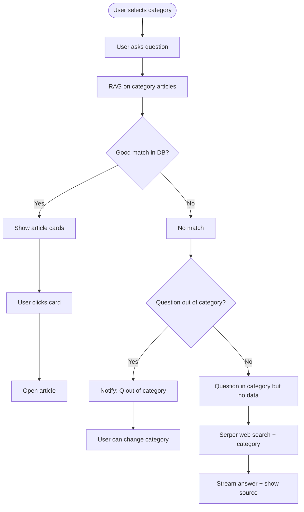

# Chatbot Flow - Updated (modonty)

## Scope - 100% Category-Based

**In-scope** = Question is about the **selected category**.  
**Out-of-scope** = Question is about a **different topic/category**.

The `isOutOfScope` check ([modonty/lib/rag/scope.ts](modonty/lib/rag/scope.ts)) compares the user's question to `categoryName` (+ articleExcerpt for context). No client, no other dimension—scope is **category only**.

---

## Plan Scope - NON-ARTICLE PAGES ONLY

| Applies to | API | Notes |
|------------|-----|-------|
| Home, client page, category page | `/api/chatbot/chat` | This plan changes this flow |
| Article page (`/articles/[slug]`) | `/api/articles/[slug]/chat` | **EXCLUDED** - keeps its own flow, NO CHANGES |

The flow below applies **only** when the user is NOT on an article page (no `articleSlug`). On article pages, scope is still category-based (the article's category).

---

## Flow Summary (non-article pages only)



## Behavior

| Scenario | Action |
|----------|--------|
| **In category, DB match** | Show article cards → user clicks to open article |
| **Out of category** | Notify "سؤالك خارج نطاق هذا الموضوع" → user can change category (no web search) |
| **In category, no DB match** | Serper (with category in query) → stream answer → show "المصدر: نتائج البحث على الويب" |

## Changes Required

### 1. Chat API - [modonty/app/api/chatbot/chat/route.ts](modonty/app/api/chatbot/chat/route.ts)

**Remove** (lines 147-175): entire `if (outOfScope)` block that calls `getArticlesForOutOfScopeSearch`, rerank, and returns redirect with articles.

**Replace with**: when `outOfScope` is true, return:
```ts
return NextResponse.json({
  type: "outOfScope",
  message: "سؤالك خارج نطاق هذا الموضوع. يمكنك اختيار موضوع آخر.",
});
```

**Serper**: Only when `!outOfScope` (in-scope, no match). Add category to query: `searchSerper(\`${lastUserMsg.content} ${category.name}\`.trim(), 8)`.

**Client filter**: Remove clientSlug/clientId (from previous plan).

### 2. ArticleChatbotContent - [modonty/components/chatbot/ArticleChatbotContent.tsx](modonty/components/chatbot/ArticleChatbotContent.tsx)

**Handle `type: "outOfScope"`** in JSON response (alongside `type: "redirect"`):
- Add assistant message with `d.message` (the out-of-scope notification)
- Show "اختيار موضوع آخر" button that clears `selectedCategory` and resets so user can pick a new topic

**Client**: Remove clientSlug from topics URL and chat body.

### 3. Topics API - [modonty/app/api/chatbot/topics/route.ts](modonty/app/api/chatbot/topics/route.ts)

Remove clientSlug param and filter.

### 4. ChatSheetProvider - [modonty/components/chatbot/ChatSheetProvider.tsx](modonty/components/chatbot/ChatSheetProvider.tsx)

Optional: remove clientSlug prop.

### 5. Tests

Update/remove tests for clientSlug and redirect-to-other-articles.

---

## Article Page Flow (unchanged, for reference)

| Scenario | Action |
|----------|--------|
| In-scope, DB match | RAG answer from article |
| In-scope, no match in article | Same-category articles → show cards; else Serper |
| Out-of-scope | Show article cards from other categories → user clicks to open |

**File:** [modonty/app/api/articles/[slug]/chat/route.ts](modonty/app/api/articles/[slug]/chat/route.ts) - **NO CHANGES**.

---

## Verification Checklist (100% confidence)

### Serper API (official)
- **Endpoint**: `https://google.serper.dev/search` (POST) - matches Serper docs
- **Auth**: `x-api-key` header - correct per Serper
- **Body**: `{ q: string, num: number }` - correct
- **Response**: `organic[]` with `title`, `link`, `snippet` - our code uses these fields
- **Error**: Serper throws → we catch, set `docs = []` → chat proceeds with empty docs (model says "لم أجد إجابة في المستندات")

### Edge cases
| Case | Behavior |
|------|----------|
| Empty category (no articles) | `allChunks = []` → retrieveFromChunks returns `{ docs: [], topScore: 0 }` → outOfScope check → Serper or outOfScope |
| Serper API failure | catch block → docs = [] → chat with no docs, no source badge |
| isOutOfScope throws | Caught by outer try/catch → 500 with generic error |
| category.name empty | Unlikely (DB constraint); `\`${q} ${name}\`.trim()` still valid |

### Cleanup on chat/route.ts
- Remove `getArticlesForOutOfScopeSearch` import
- Remove `rerank` import (only used in removed block)

### UI outOfScope handling
- Add `if (d.type === "outOfScope")` before redirect check; **must return** (body consumed by res.json())
- Append assistant message: `d.message`
- User clicks existing "←" button to change category (no new UI needed)
