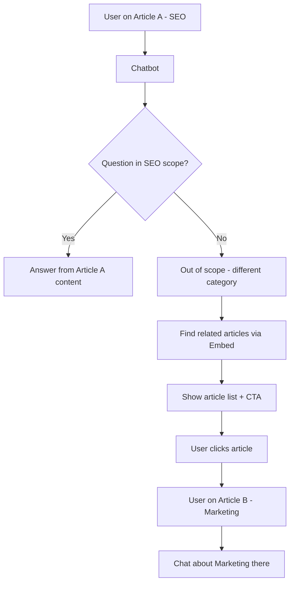
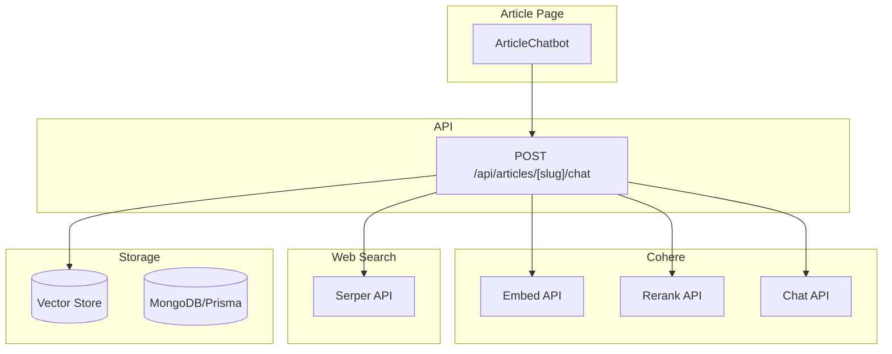

# Cohere Article Chatbot Plan for Modonty

## Primary Feature: Article-Scoped Chatbot

**User flow:**

1. User opens an article (e.g. SEO topic).
2. A chatbot appears on the article page.
3. User chats with Modonty about the **article's category/field** (e.g. SEO).
4. If the user asks about something **outside** that category (e.g. marketing):
   - The bot detects it is out-of-scope.
   - It shows **related articles** from other categories that match the question.
   - It tells the user: "اختر مقالاً وابدأ المحادثة هناك" (Select an article and start chatting there).
5. User clicks a suggested article → goes to that article page → chats about that topic there.



---

## Feature 1: Article-Scoped Chatbot (Primary)

**Behavior**:
- Chatbot on each article page; answers from current article content (RAG).
- Scope = article's category (e.g. SEO, marketing, design).
- If user asks about another category: detect out-of-scope, show related articles, tell user to select an article and chat there.
- **Web search fallback** (same category only): If no answer in article or similar articles, search the web and answer from web results. Out-of-scope questions never use web search; they always show related articles.

**Implementation**:

1. **Chat UI**: Floating chat widget or sidebar on [article page](modonty/app/articles/[slug]/page.tsx).
2. **API** `POST /api/articles/[slug]/chat`:
   - **In-scope**: Try RAG from current article. If relevance high → answer. If low → try similar articles (same category). If still no answer → **web search** (Tavily/Serper) → pass results to Chat → answer from web.
   - **Out-of-scope**: Embed query, find articles from other categories, Rerank, return `{ type: "redirect", articles: [...], message: "..." }`.
3. **Web search fallback** (same category only): Use **Serper API** (serper.dev) – call Serper for search results, pass to Cohere Chat as documents. Cohere web-search connector is deprecated (Sept 2025). Add note: "المصدر: نتائج البحث على الويب" (Source: web search).
5. **Out-of-scope detection** (choose one):
   - **Option A**: Embed user message (`search_query`) and category text (`search_document`); cosine similarity below threshold = out-of-scope.
   - **Option B**: Chat with system prompt: "Is this question about [category name]? Answer only yes or no." Parse response.
6. **Chunking**: Split article content by section (~512 tokens); embed each chunk with `input_type="search_document"`.
7. **UI**: Render clickable article cards when type is "redirect"; user clicks and navigates to that article to chat there.

**Key files**:
- New: `modonty/components/ArticleChatbot.tsx`
- New: `modonty/app/api/articles/[slug]/chat/route.ts`

---

## In-Scope Logic (Same Category)

```
User question (same category)
    │
    ▼
RAG from current article
    │
    ├─ Relevance HIGH → Answer from article (stream)
    │
    └─ Relevance LOW
           │
           ▼
       Search similar articles (same category)
           │
           ├─ Found relevant → Answer from those articles (stream)
           │
           └─ None found / still low relevance
                  │
                  ▼
              Serper API → pass results to Cohere Chat
                  │
                  ▼
              Answer from web (stream)
              + "المصدر: نتائج البحث على الويب"
```

---

## Technical Architecture



---

## Implementation Phases

### Phase 1: Foundation (Embed + Storage)
- Add Cohere SDK (`cohere-ai`)
- Choose vector storage (Pinecone, pgvector, or Cohere Connectors)
- Store article embeddings with metadata: `articleId`, `categoryId`, `slug`, `title`, `excerpt`
- Category metadata enables filtering "other categories" for out-of-scope search
- Script to backfill embeddings for existing articles (batch 90 per Embed call)

### Phase 2: Article Chatbot
- Create `ArticleChatbot` component (floating widget)
- Create `POST /api/articles/[slug]/chat` route
- Implement in-scope RAG (current article content)
- Implement relevance check; if low → try similar articles (same category)
- **Web search fallback**: If no answer in articles, call Serper API, pass results to Cohere Chat, stream answer (same category only)
- Implement out-of-scope detection (embed user message vs category)
- Implement out-of-scope flow: semantic article search, Rerank, return redirect response
- Add chatbot to article page layout

### Phase 3: Polish
- Arabic messaging ("اختر مقالاً وابدأ المحادثة هناك")
- Loading states, error handling
- Mobile-responsive chat UI

---

## Cohere API Specification (Official Docs Verified)

### Embed API
- **Model**: `embed-multilingual-v3.0` (Arabic + 100+ languages, 1024 dims, 512 max tokens)
- **Alternative**: `embed-multilingual-light-v3.0` (faster, 384 dims) or `embed-v4.0` (latest)
- **Required params**: `input_type` – use `search_document` for indexing articles, `search_query` for user queries
- **Batch limit**: Max 96 texts per Embed call (chunk in batches)
- **Docs**: https://docs.cohere.com/docs/cohere-embed

### Rerank API
- **Model**: `rerank-multilingual-v3.0` (Arabic + same languages as embed-multilingual-v3.0)
- **Alternative**: `rerank-v4.0-fast` (low latency) or `rerank-v4.0-pro` (best quality)
- **Limit**: Avoid more than 1,000 documents per request
- **Tip**: Format structured data as YAML strings for better performance
- **Docs**: https://docs.cohere.com/docs/rerank

### Chat API (RAG)
- **Model**: `command-r` or `command-r-plus` (RAG-optimized, citations)
- **RAG flow**: Pass `documents` array (retrieved chunks) to `chat` or `chat_stream`
- **Web search**: Serper API – fetch results, pass as `documents` to Chat (connector deprecated)
- **Streaming**: Use `chat_stream` with `content-delta` events
- **Optional**: `search_queries_only=True` for query generation (we use custom scope check instead)
- **Docs**: https://docs.cohere.com/docs/chat-api, https://docs.cohere.com/v1/docs/faster-web-search

### RAG Best Practice (from Cohere Cookbook)
1. Chunk article content (e.g. by section/title, ~512 tokens)
2. Embed chunks with `input_type="search_document"`
3. Embed user query with `input_type="search_query"`
4. Retrieve top_k (e.g. 10) via vector similarity
5. Rerank to top_n (e.g. 3) before passing to Chat
6. Pass reranked docs to Chat `documents` param for grounded response with citations

---

## Performance Optimizations

| Area | Recommendation |
|------|----------------|
| Embed batching | Batch up to 90–96 texts per call |
| RAG retrieval | retrieve_top_k=10, rerank_top_n=3 |
| Chunking | ~512 tokens, chunk by section/title |
| Scope check | Cache category embeddings; single Embed call for user message |
| Out-of-scope search | Filter by category in vector store metadata; exclude current category |
| Streaming | Use `chat_stream` for in-scope answers; no stream for redirect |

---

## Dependencies and Considerations

- **Cohere API key**: Required; store in `COHERE_API_KEY`
- **Web search**: Serper API (serper.dev) – ~$0.0003/search, 2,500 free. Cohere web-search connector deprecated.
- **Arabic support**: `embed-multilingual-v3.0` and `rerank-multilingual-v3.0` support Arabic
- **MongoDB**: No native vector search; use Pinecone, pgvector, or Cohere Connectors
- **Cost**: Embed, Rerank, Chat, and web search API are usage-based

---

## Key Files to Create/Modify

| File | Change |
|------|--------|
| `modonty/components/ArticleChatbot.tsx` | New – chat UI, handles in-scope answers and out-of-scope article list |
| `modonty/app/api/articles/[slug]/chat/route.ts` | New – chat + scope detection + article search |
| `modonty/app/articles/[slug]/page.tsx` | Add ArticleChatbot component |

---

## Plan Verification Checklist

| Item | Status |
|------|--------|
| Cohere models for Arabic | embed-multilingual-v3.0, rerank-multilingual-v3.0 |
| Embed input_type | search_document (indexing), search_query (queries) |
| RAG flow | Chunk → Embed → Retrieve → Rerank → Chat with documents |
| Batch limits | 96 texts per Embed, 1000 docs max per Rerank |
| Scope detection | Embed similarity or Chat classification |
| Out-of-scope filter | Vector store metadata filter by categoryId |
| Streaming | chat_stream for in-scope; JSON for redirect |
