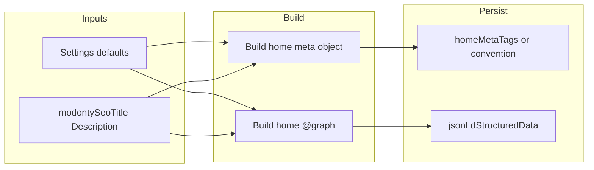

# Modonty Setting: Meta and JSON-LD Creation & Validation

This document describes how **meta tags** and **JSON-LD** are created and validated in the Modonty setting flow. Use it as a reference for discussion and future changes.

**Page:** `http://localhost:3000/modonty/setting` (or `/modonty/setting` in production).  
**Section in scope:** the **Generated SEO** tab/section (Generate button, live preview, Save from form, meta + JSON-LD display).

---

## Modonty site & home page (context)

**Modonty site** = the public-facing app in the repo at `modonty/`. It is the main site users see (RTL Arabic, مودونتي). URL base: `NEXT_PUBLIC_SITE_URL` or `https://modonty.com`.

**Home page** (`modonty/app/page.tsx`, route `/`):

- **Content:** Article feed. Fetches latest 10 articles via `getArticles({ limit: 10 })`, maps them to posts, and renders `<FeedContainer posts={posts} />`. So the home page is a **collection of articles**, not a static “about” or legal page.
- **Data source:** The home page is **not** backed by `db.modonty`. It has no Modonty record; meta and JSON-LD are defined in the page itself.
- **Meta:** `generateMetadata()` uses `generateMetadataFromSEO()` with **hardcoded** Arabic values: title "أحدث المقالات والمدونات", description about latest articles and blogs, keywords, type "website", locale "ar_SA". No Settings or Modonty DB.
- **JSON-LD:** A single **CollectionPage** is inlined in the page: `@type: CollectionPage`, name/description/url, and `mainEntity` = **ItemList** of the same 10 articles (each a ListItem with Article headline, description, url, datePublished, author, publisher). There is **no** Organization or WebSite node in the home page JSON-LD today (the spec in `documents/MODONTY-HOME-ABOUT-SEO-SPEC.md` suggests adding Organization + WebSite + WebPage in a `@graph` for home).

**Other Modonty routes** (about, terms, legal/*) **are** backed by `db.modonty`: each has a record keyed by slug (e.g. `about`, `user-agreement`, `privacy-policy`). Their meta and JSON-LD come from **admin Modonty setting** (Generated SEO): edited in admin, stored on the Modonty record, and read by the site when rendering those pages.

**Summary:** Admin **modonty/setting** (Generated SEO) drives meta/JSON-LD only for **Modonty DB pages** (about, terms, legal). The **home page** is a separate, custom feed page with its own hardcoded meta and CollectionPage JSON-LD; it does not use `db.modonty` or the admin-generated meta/JSON-LD.

---

## Goal: Create meta/JSON-LD and store in Settings DB

Based on the Modonty site & home page context above:

- **Create** meta tags and JSON-LD for the home page (and/or site-level identity: Organization, WebSite, etc.).
- **Store** the generated meta tags and JSON-LD in the **Settings DB** (admin `db.settings`), not in `db.modonty`.

So the flow is: **generate** meta + JSON-LD (using Settings defaults, Modonty defaults, and home-page data where needed) → **validate** → **persist** to the single Settings record (e.g. `metaTags` and `jsonLdStructuredData`-style fields on Settings, or dedicated home-page fields). The Modonty site home page can then read meta/JSON-LD from Settings instead of hardcoding them.

---

## 100% full coverage for home page (meta + JSON-LD using Settings)

This section defines what **100% full coverage** means for the home page meta tags and JSON-LD, based on official specs, and how each property is sourced from the **Settings table**. Use it as the target spec when generating and storing home meta/JSON-LD in Settings DB.

### Official references

- **Open Graph:** [ogp.me](https://ogp.me/) — required: og:title, og:type, og:image, og:url; recommended: og:description, og:site_name, og:locale, og:locale:alternate, og:determiner; image width/height/type/alt.
- **Twitter Cards:** [X Developer Docs – Cards markup](https://developer.x.com/en/docs/twitter-for-websites/cards/overview/markup) — required: twitter:card; for summary cards: twitter:site or twitter:site:id; recommended: twitter:title, twitter:description, twitter:image, twitter:image:alt, twitter:creator.
- **Google / SEO:** [Google meta tags](https://developers.google.com/search/docs/crawling-indexing/special-tags), [canonical](https://developers.google.com/search/docs/crawling-indexing/consolidate-duplicate-urls) — best practice: title, meta description, charset, viewport, rel="canonical", meta robots (and optionally googlebot).
- **Schema.org JSON-LD:** [WebSite](https://schema.org/WebSite), [Organization](https://schema.org/Organization), [WebPage](https://schema.org/WebPage), [CollectionPage](https://schema.org/CollectionPage), [ItemList](https://schema.org/ItemList) — home page: @graph with Organization + WebSite + WebPage or CollectionPage; CollectionPage uses mainEntity = ItemList for articles.

### Meta checklist (100% coverage)

| Category | Property | Source (Settings default field) |
|----------|----------|----------------------------------|
| **OG required** | og:title | modontySeoTitle ?? siteName |
| | og:type | defaultOgType |
| | og:image | ogImageUrl ?? logoUrl |
| | og:url | siteUrl (home = siteUrl or siteUrl + "/") |
| **OG recommended** | og:description | modontySeoDescription ?? brandDescription |
| | og:site_name | siteName |
| | og:locale | defaultOgLocale |
| | og:locale:alternate | defaultHreflang, defaultPathname, inLanguage |
| | og:determiner | defaultOgDeterminer |
| | og:image:width/height/type/alt | defaultOgImageWidth, defaultOgImageHeight, defaultOgImageType, altImage |
| **Twitter** | twitter:card | defaultTwitterCard |
| | twitter:site / twitter:site:id | twitterSite, twitterSiteId |
| | twitter:title | modontySeoTitle ?? siteName |
| | twitter:description | modontySeoDescription ?? brandDescription |
| | twitter:image, twitter:image:alt | ogImageUrl ?? logoUrl, altImage |
| | twitter:creator / twitter:creator:id | twitterCreator, twitterCreatorId |
| **Google / SEO** | title | modontySeoTitle ?? siteName |
| | meta description | modontySeoDescription ?? brandDescription |
| | charset | defaultCharset |
| | viewport | defaultViewport |
| | canonical | siteUrl |
| | robots / googlebot | defaultMetaRobots, defaultGooglebot |
| **Extra** | hreflang | defaultHreflang, defaultPathname, inLanguage |
| | theme-color | themeColor |
| | author | siteAuthor |

### JSON-LD checklist (100% coverage)

| Node | Properties | Source (Settings) |
|------|------------|-------------------|
| **Organization** (@id siteUrl#organization) | name, url, description, inLanguage | siteName, siteUrl, brandDescription, inLanguage |
| | logo, sameAs, contactPoint, address, geo | orgLogoUrl/logoUrl, sameAs (social URLs), orgContact*, orgAddress*, orgGeoLatitude/Longitude |
| **WebSite** (@id siteUrl#website) | name, url, description, inLanguage, publisher→Organization | siteName, siteUrl, brandDescription, inLanguage |
| | potentialAction (SearchAction) | orgSearchUrlTemplate |
| **WebPage or CollectionPage** (@id siteUrl#webpage or #collectionpage) | name, url, description, isPartOf→WebSite, inLanguage, dateModified | modontySeoTitle ?? siteName, siteUrl, modontySeoDescription ?? brandDescription |
| | mainEntity (ItemList for CollectionPage) | Generated from home page article list (not from Settings) |

### Current home page vs 100% (gaps)

**Current home** ([modonty/app/page.tsx](modonty/app/page.tsx)):

- Meta: hardcoded title, description, keywords, type, locale via generateMetadataFromSEO(); no OG image, no Twitter card/site/creator/image, no canonical/robots in a single built meta object, no hreflang, no theme-color; not driven by Settings.
- JSON-LD: single CollectionPage + ItemList (articles only); no Organization, no WebSite, no @graph with stable @id s.

**Missing for 100%:**

- Meta: OG image, og:url, og:site_name, og:locale (and locale:alternate, determiner, image dimensions/alt); Twitter card, site, creator, image, image:alt; canonical and robots in built meta; hreflang; theme-color; author; all sourced from Settings and stored in Settings.
- JSON-LD: Add Organization + WebSite to a @graph; keep CollectionPage + ItemList; link via isPartOf/publisher; store @graph string in Settings.jsonLdStructuredData.

### Storage in Settings DB

- **JSON-LD:** Store the generated home @graph string in **Settings.jsonLdStructuredData**. Set **Settings.jsonLdLastGenerated** and **Settings.jsonLdValidationReport** when generating/validating. (Settings already has these columns.)
- **Meta:** Settings has no column today for a pre-built home meta object. For 100% coverage including storage, add **homeMetaTags Json?** (or equivalent) to the Settings model and persist the built home meta object there after generation. Alternatively, use a convention (e.g. a Json column that holds `{ home: { metaTags: {...} }, ... }`). The Modonty site home page would then read meta from Settings (e.g. homeMetaTags) instead of hardcoding.

### Flow (target)



Settings (defaults) + modontySeoTitle/modontySeoDescription → build home meta + build home @graph → validate → store meta in Settings (e.g. homeMetaTags) and @graph in Settings.jsonLdStructuredData; Modonty site home page reads from Settings.

### Simulated objects (home page meta + JSON-LD)

Example shapes for the **home meta object** and the **home @graph**, aligned with the notes below: 100% meta checklist (Settings defaults), JSON-LD with Organization + WebSite + CollectionPage, **limit 20** items in itemListElement, **numberOfItems** = total article count, **publisher (client)** per Article, **articleSection (category)** and **keywords (tags)** in the Article schema only (no HTML meta keywords). Values are placeholders from Settings and article data.

**1. Simulated home meta object** (e.g. `Settings.homeMetaTags`):

```json
{
  "charset": "UTF-8",
  "viewport": "width=device-width, initial-scale=1",
  "title": "أحدث المقالات والمدونات",
  "description": "استكشف أحدث المقالات والمدونات الاحترافية من أفضل الكتّاب والمؤلفين.",
  "robots": "index, follow",
  "googlebot": "index, follow",
  "themeColor": "#3030FF",
  "canonical": "https://modonty.com",
  "author": "مودونتي",
  "hreflang": [
    { "lang": "ar", "href": "https://modonty.com" },
    { "lang": "x-default", "href": "https://modonty.com" }
  ],
  "sitemapPriority": 0.5,
  "sitemapChangeFreq": "monthly",
  "openGraph": {
    "title": "أحدث المقالات والمدونات",
    "description": "استكشف أحدث المقالات والمدونات الاحترافية من أفضل الكتّاب والمؤلفين.",
    "type": "website",
    "url": "https://modonty.com",
    "siteName": "مودونتي",
    "locale": "ar_SA",
    "localeAlternate": [],
    "determiner": "auto",
    "images": [
      {
        "url": "https://modonty.com/og-image.jpg",
        "secure_url": "https://modonty.com/og-image.jpg",
        "type": "image/jpeg",
        "width": 1200,
        "height": 630,
        "alt": "مودونتي - منصة المدونات"
      }
    ]
  },
  "twitter": {
    "card": "summary_large_image",
    "title": "أحدث المقالات والمدونات",
    "description": "استكشف أحدث المقالات والمدونات الاحترافية من أفضل الكتّاب والمؤلفين.",
    "imageAlt": "مودونتي - منصة المدونات",
    "site": "@modonty",
    "creator": "@modonty",
    "image": "https://modonty.com/og-image.jpg",
    "siteId": "",
    "creatorId": ""
  }
}
```

**2. Simulated home JSON-LD** (e.g. `Settings.jsonLdStructuredData` — @graph with Organization, WebSite, CollectionPage + ItemList):

```json
{
  "@context": "https://schema.org",
  "@graph": [
    {
      "@type": "Organization",
      "@id": "https://modonty.com/#organization",
      "name": "مودونتي",
      "url": "https://modonty.com",
      "description": "منصة محتوى عربية بالاشتراك تعتمد نظام المدونة المرجعية.",
      "inLanguage": "ar",
      "logo": {
        "@type": "ImageObject",
        "url": "https://modonty.com/logo.png",
        "width": 512,
        "height": 512
      },
      "sameAs": ["https://twitter.com/modonty", "https://facebook.com/modonty"],
      "contactPoint": {
        "@type": "ContactPoint",
        "contactType": "customer service",
        "email": "contact@modonty.com",
        "areaServed": "SA"
      }
    },
    {
      "@type": "WebSite",
      "@id": "https://modonty.com/#website",
      "name": "مودونتي",
      "url": "https://modonty.com",
      "description": "منصة محتوى عربية بالاشتراك — مدونة مرجعية ومقالات احترافية.",
      "inLanguage": "ar",
      "publisher": { "@id": "https://modonty.com/#organization" },
      "potentialAction": {
        "@type": "SearchAction",
        "target": { "@type": "EntryPoint", "urlTemplate": "https://modonty.com/search?q={search_term_string}" },
        "query-input": "required name=search_term_string"
      }
    },
    {
      "@type": "CollectionPage",
      "@id": "https://modonty.com/#collectionpage",
      "name": "أحدث المقالات والمدونات",
      "url": "https://modonty.com",
      "description": "مجموعة من أحدث المقالات والمدونات الاحترافية",
      "inLanguage": "ar",
      "isPartOf": { "@id": "https://modonty.com/#website" },
      "dateModified": "2025-01-31T12:00:00.000Z",
      "mainEntity": {
        "@type": "ItemList",
        "itemListOrder": "ItemListOrderDescending",
        "numberOfItems": 42,
        "itemListElement": [
          {
            "@type": "ListItem",
            "position": 1,
            "item": {
              "@type": "Article",
              "headline": "مقال تجريبي ١",
              "description": "ملخص المقال.",
              "url": "https://modonty.com/articles/sample-1",
              "datePublished": "2025-01-30T10:00:00.000Z",
              "author": { "@type": "Person", "name": "مودونتي" },
              "publisher": {
                "@type": "Organization",
                "name": "عميل ١",
                "url": "https://modonty.com/clients/client-1",
                "logo": "https://modonty.com/clients/client-1/logo.png"
              },
              "articleSection": "تقنية",
              "keywords": "تطوير, ويب, فرونت اند"
            }
          },
          {
            "@type": "ListItem",
            "position": 2,
            "item": {
              "@type": "Article",
              "headline": "مقال تجريبي ٢",
              "description": "ملخص المقال.",
              "url": "https://modonty.com/articles/sample-2",
              "datePublished": "2025-01-29T10:00:00.000Z",
              "author": { "@type": "Person", "name": "مودونتي" },
              "publisher": {
                "@type": "Organization",
                "name": "عميل ٢",
                "url": "https://modonty.com/clients/client-2",
                "logo": "https://modonty.com/clients/client-2/logo.png"
              },
              "articleSection": "تصميم",
              "keywords": "واجهات, تجربة مستخدم"
            }
          }
        ]
      }
    }
  ]
}
```

**Simulation notes:** The meta object above follows the 100% meta checklist (OG, Twitter, Google/SEO, hreflang, theme-color, author); no HTML meta keywords. The JSON-LD above: **numberOfItems: 42** = total articles in DB (example); **itemListElement** shows 2 items (in real run use limit 20). Each Article includes **publisher** (client Organization with name, url, logo), **articleSection** (category name), and **keywords** (tags in JSON-LD schema only).

**itemListElement:** In implementation, loop over the article list (e.g. from `getArticles({ limit: 20 })`) and add one `ListItem` per article to the array (position = index + 1, item = Article with headline, description, url, datePublished, author, publisher, articleSection, keywords). The simulated example above shows two items; the real array has up to 20 items. Set **numberOfItems** to the total article count in the DB.

**Recommended limit:** Use **20** items in `itemListElement` when generating in admin (e.g. `getArticles({ limit: 20 })`). Set **`numberOfItems`** to the total article count in the DB so search engines know the full catalog size. Meta and JSON-LD are generated once and stored; the home page reads from DB for page speed.

**Publisher (client) per article:** Add the **Organization (client)** inside each **Article** in the list via the **`publisher`** property. Each ListItem → item → Article should have `publisher`: `{ "@type": "Organization", "name": client.name, "url": clientUrl, "logo": clientLogo }`. Per Schema.org/Google, each Article must have its publisher as an Organization; no separate homepage-level list of clients is required.

**Category per article:** Add **`articleSection`** to each **Article** when the article has a category. Per Schema.org, `articleSection` is a Text value (e.g. the category name, like "Sports" or "Lifestyle"). Use `articleSection: article.category?.name` (or category slug/label). No separate homepage-level list of categories is required; per-article articleSection is the standard approach.

**Tags per article:** Use **Schema.org `keywords`** in the Article JSON-LD for tags. Add `keywords` to each Article when the article has tags (e.g. `keywords: article.tags?.map(t => t.name).join(", ")` or an array of tag names). **HTML meta keywords** (`<meta name="keywords">`) are deprecated — Google does not use them; do not add a keywords meta tag. Only use `keywords` in the JSON-LD Article schema. No separate homepage-level list of tags is required.

**Article count has no effect on:** (1) **Meta** — home meta (title, description, OG, Twitter, canonical, etc.) is built only from Settings + modontySeoTitle/modontySeoDescription; it does not depend on how many articles exist. (2) **Rest of JSON-LD** — Organization, WebSite, and CollectionPage (name, url, description, isPartOf, dateModified) stay the same; only the ItemList’s `itemListElement` array length and `numberOfItems` change with the number of articles.

All values above are placeholders; in implementation they come from Settings (siteUrl, siteName, modontySeoTitle, modontySeoDescription, brandDescription, defaultOgType, ogImageUrl, defaultOgLocale, defaultTwitterCard, twitterSite, twitterCreator, orgLogoUrl, sameAs, contactPoint, orgSearchUrlTemplate, etc.) and for CollectionPage.mainEntity from the live article list (e.g. getArticles).

---

## 1. Overview

| Concern | Where it lives | Main entry points |
|--------|----------------|--------------------|
| **Meta creation** | `helpers/build-meta-from-page.ts` | `generate-modonty-page-seo`, `get-live-preview-seo` |
| **JSON-LD creation** | `helpers/generate-modonty-page-jsonld.ts` | Same actions |
| **JSON-LD normalization** | `helpers/jsonld-normalize.ts` | Before validation / before save |
| **Validation** | `helpers/modonty-jsonld-validator.ts` | `validate-modonty-seo`, generate/save flows |
| **Page config** | `helpers/page-config.ts` | JSON-LD (AboutPage vs WebPage, breadcrumb) |

Data sources:

- **Page**: `db.modonty` (slug, title, seoTitle, seoDescription, images, OG/Twitter fields, etc.).
- **Site defaults**: `getAllSettings()` from admin Settings (Technical, Site, Organization tabs).

---

## 2. Meta creation

### 2.1 Builder: `build-meta-from-page.ts`

- **Input**: A page-like object (`PageLikeForMeta`) and options (`BuildMetaOptions`) from Settings.
- **Output**: A single meta object used for `<head>` (charset, viewport, title, description, robots, openGraph, twitter, canonical, hreflang, sitemap, author).

Logic summary:

- **Canonical / URL**: From `page.canonicalUrl` or `siteUrl + "/" + slug`. URLs are normalized with `ensureAbsoluteUrl()`.
- **Title**: `seoTitle || title || defaultSiteName || "Modonty"`. Truncated to `titleMaxLength` (default 60) with `defaultTruncationSuffix`.
- **Description**: `seoDescription`; truncated to `descriptionMaxLength` (default 160).
- **Robots / Googlebot**: From page or Settings defaults.
- **Open Graph**: title, description, type, url, siteName, locale, images (from ogImage/socialImage/heroImage), etc. All defaults come from Settings.
- **Twitter**: card, title, description, image, site, creator, etc.
- **Hreflang**: Built from `alternateLanguages` (array of `{ hreflang, url }`) or from `ogLocaleAlternate` (comma-separated) + primary locale + x-default.

So: **meta is built from page fields + Settings (Technical, Site, Organization)**. No direct use of `modontySeoTitle` / `modontySeoDescription` from Settings in this file; fallbacks are page title and `defaultSiteName`.

### 2.2 Where meta is produced

1. **Generate (persist)**  
   - **Action**: `generate-modonty-page-seo.ts` → `generateModontyPageSEO(slug)`.  
   - Loads page from DB, builds `ModontySiteConfig` from Settings, calls `buildMetaFromPageLike(page, options)`, then saves `metaTags` (and JSON-LD + validation report) to `db.modonty`.

2. **Live preview (no persist)**  
   - **Action**: `get-live-preview-seo.ts` → `getLivePreviewSEO(slug, formData)`.  
   - Same build, but the “page” is `formData` (current form state). Returns `{ metaTags, jsonLd }` for UI preview. No DB write.

3. **Save from form**  
   - **Action**: `save-generated-seo-from-form.ts` → `saveGeneratedSeoFromForm(slug, formData)`.  
   - Calls `getLivePreviewSEO(slug, formData)` to get meta + JSON-LD, then saves both to `db.modonty` (and runs JSON-LD validation before save).

---

## 3. JSON-LD creation

### 3.1 Generator: `generate-modonty-page-jsonld.ts`

- **Input**: `ModontySiteConfig` (siteUrl, siteName, brandDescription, sameAs, contactPoint, logo, knowsLanguage, address, geo, searchUrlTemplate) and `ModontyPageForJsonLd` (slug, title, seoTitle, seoDescription, canonicalUrl, inLanguage, images, updatedAt).
- **Output**: One JSON-LD object with `@context: "https://schema.org"` and `@graph` array.

**@graph nodes:**

1. **Organization**  
   - From config: name, url, description, sameAs, contactPoint, logo, image (page image), knowsLanguage, address (optional).

2. **WebSite**  
   - name, url, description, inLanguage, publisher → Organization.  
   - Optional `potentialAction` (SearchAction) if `searchUrlTemplate` is set.

3. **WebPage or AboutPage**  
   - Type: `AboutPage` if slug is in `page-config` (about, user-agreement, privacy-policy, etc.), else `WebPage`.  
   - name (seoTitle || title || "Modonty"), url, mainEntityOfPage, description, publisher, isPartOf → WebSite, inLanguage, dateModified, primaryImageOfPage.  
   - AboutPage adds `headline`, `about` → Organization, and `breadcrumb` → BreadcrumbList.

4. **BreadcrumbList** (only for AboutPage)  
   - Two items: site home, current page.

Site config is built in `generate-modonty-page-seo` and `get-live-preview-seo` from `getAllSettings()` and `getSameAsFromSettings()` (sameAs, contact, logo, address, geo, searchUrlTemplate, knowsLanguage).

### 3.2 Normalization: `jsonld-normalize.ts`

- **Input**: Raw JSON-LD object.  
- **Output**: Normalized object via `jsonld.expand()` then `jsonld.compact(..., { "@context": "https://schema.org" })`.  
Used before validation and before persisting in generate/save flows so validators and stored data see a consistent shape.

---

## 4. Validation

### 4.1 Meta: `validateMetaTags(meta)` in `modonty-jsonld-validator.ts`

- **Required keys**: `title`, `description`, `canonical`, `robots`, `openGraph`, `twitter`, `hreflang`.  
- **Warnings**: openGraph should have title, url, locale; twitter should have card.  
- **Return**: `{ valid, errors[], warnings[] }`.

### 4.2 JSON-LD: `validateModontyPageJsonLdComplete(jsonLd)` in `modonty-jsonld-validator.ts`

Runs four checks (Adobe, AJV, jsonld.js, custom) and returns `ModontyValidationReport`:

| Check | What it does |
|-------|-------------------------------|
| **Adobe** | Fetches Schema.org context, converts JSON-LD to WAE format, runs `@adobe/structured-data-validator`. |
| **AJV** | JSON Schema: object with `@context`, `@graph` (array, min 1 item; each item has `@type`, optional `@id`, name, description, url, etc.). |
| **jsonld.js** | `jsonld.expand(jsonLd)`; success = valid. |
| **Custom** | Ensures `@graph` exists; at least one node is WebPage or AboutPage; optional warning if that node has neither name nor description. |

Return shape: `{ adobe: { valid, errors, warnings }, ajv: { valid, errors, warnings }, jsonldJs: { valid, errors }, custom: { errors, warnings } }`.

### 4.3 Where validation is used

- **Generate**: After building meta + JSON-LD, normalizes JSON-LD and runs `validateModontyPageJsonLdComplete`; stores report in `jsonLdValidationReport` on the page.
- **Save from form**: Same: get meta + JSON-LD from `getLivePreviewSEO`, normalize JSON-LD, run `validateModontyPageJsonLdComplete`, save meta + JSON-LD string + validation report.
- **Validate (UI)**:  
  - **Stored data**: `validateModontyPageSEO(slug)` loads page, runs `validateMetaTags(metaTags)` and `validateModontyPageJsonLdComplete(normalize(jsonLdStructuredData))`.  
  - **Live preview**: `validateLivePreviewSEO(slug, formData)` uses `getLivePreviewSEO` then validates the returned meta + JSON-LD (no normalize for meta; JSON-LD is validated as parsed).

---

## 5. UI flow (Modonty setting page)

**URL:** `http://localhost:3000/modonty/setting`. The **Generated SEO** tab is the section with Generate, live preview, and Save.

- **Page form**: Basic fields, SEO fields, media. Form state is `PageFormData` (see `page-schema.ts`).
- **Generated SEO** (`components/sections/generated-seo-section.tsx`):  
  - “Generate” button → `generateModontyPageSEO(slug)` (from DB).  
  - Live preview: debounced `getLivePreviewSEO(slug, formData)` from current form.  
  - “Save” (live preview) → `saveGeneratedSeoFromForm(slug, formData)`.  
  - Shows meta tags + JSON-LD (stored or live), copy actions.
- **Validation report section** (`validation-report-section.tsx`):  
  - “Validate Meta & JSON-LD” → `validateModontyPageSEO(slug)` (validates stored data).  
  - Displays meta result (valid/errors/warnings) and JSON-LD result (Adobe, AJV, jsonld.js, custom).

---

## 6. Data flow summary

```
Page (DB) + Settings (DB)
        ↓
buildMetaFromPageLike(pageLike, options)  →  metaTags
generateModontyPageJsonLd(config, page)  →  rawJsonLd
        ↓
normalizeModontyJsonLd(rawJsonLd)        →  normalized (for validation + sometimes store)
validateModontyPageJsonLdComplete(...)   →  validation report
        ↓
Stored on db.modonty: metaTags, jsonLdStructuredData, jsonLdLastGenerated, jsonLdValidationReport
```

**Live preview path:** Form state → `formDataToPageLike` / `pageForJsonLd` → same builders → `{ metaTags, jsonLd }` (no DB). Save path then persists that result and runs validation before save.

---

## 7. Settings vs Modonty defaults

- **Technical / Site / Organization** (admin Settings): Used for meta (defaults for robots, OG, Twitter, charset, viewport, hreflang, etc.) and for JSON-LD site config (siteName, brandDescription, sameAs, contactPoint, logo, address, geo, searchUrlTemplate, knowsLanguage).
- **Modonty META/JSON-LD tab** (admin Settings): `modontySeoTitle`, `modontySeoDescription` are “default SEO title and description for Modonty App”. They are **not** currently passed into `build-meta-from-page` or `generate-modonty-page-jsonld` in the modonty/setting flow. To use them as fallbacks when a Modonty page has no `seoTitle`/`seoDescription`, the build steps (e.g. in `buildMetaFromPageLike` and/or the JSON-LD name/description) would need to accept and use these defaults.

---

## 8. Files quick reference

| File | Role |
|------|------|
| `helpers/build-meta-from-page.ts` | Build meta object from page-like + options. |
| `helpers/generate-modonty-page-jsonld.ts` | Build @graph JSON-LD (Organization, WebSite, WebPage/AboutPage, BreadcrumbList). |
| `helpers/jsonld-normalize.ts` | Expand + compact JSON-LD. |
| `helpers/modonty-jsonld-validator.ts` | validateMetaTags, validateModontyPageJsonLdComplete (Adobe, AJV, jsonld.js, custom). |
| `helpers/page-config.ts` | Slug → label, modontyPath; which slugs are AboutPage. |
| `helpers/page-schema.ts` | Zod schema and PageFormData for the form. |
| `actions/generate-modonty-page-seo.ts` | Generate meta + JSON-LD from DB page, validate, save to DB. |
| `actions/get-live-preview-seo.ts` | Meta + JSON-LD from form data (no save). |
| `actions/save-generated-seo-from-form.ts` | Meta + JSON-LD from form → validate JSON-LD → save to DB. |
| `actions/validate-modonty-seo.ts` | Validate stored page SEO; validate live preview SEO (meta + JSON-LD). |
| `components/sections/generated-seo-section.tsx` | Generate, live preview, save from form. |
| `components/sections/validation-report-section.tsx` | Run validation, show report. |

---

You can use this doc to discuss where to plug in Modonty default title/description, add new validators, or change how meta/JSON-LD are built or stored.
