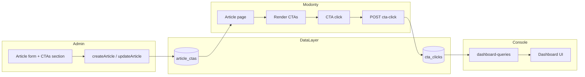

# CTA flow: Admin → Modonty → Console

End-to-end plan: define CTAs in admin, show and track them on Modonty, read in console.

---

## 1. Data layer (schema)

**New model: CTA definition per article**

- Add model `ArticleCTA` in [dataLayer/prisma/schema/schema.prisma](dataLayer/prisma/schema/schema.prisma):
  - `id`, `articleId` (required), `article` relation
  - `type` (CTAType: BUTTON, LINK, FORM, BANNER, POPUP)
  - `label` (String) — e.g. "اقرأ المزيد", "اشترك"
  - `targetUrl` (String) — href or route
  - `position` (Int, optional) — order when multiple CTAs
  - `createdAt`, `updatedAt`
  - `@@map("article_ctas")`, index on `articleId`
- Add relation on `Article`: `ctas ArticleCTA[]`
- Run migration after schema change.

**Existing:** `CTAClick` and `cta_clicks` table stay as-is (tracking events). Console already reads them.

---

## 2. Admin app

**2.1 Form data and types**

- In [admin/lib/types/form-types.ts](admin/lib/types/form-types.ts): add to `ArticleFormData`:
  - `ctas?: Array<{ type: CTAType; label: string; targetUrl: string; position?: number }>`
- Optional: export a `CTAItem` interface for reuse.

**2.2 Article form UI**

- New section or block **"CTAs"** in the article form (e.g. in [admin/app/(dashboard)/articles/components/article-form-sections.tsx](admin/app/(dashboard)/articles/components/article-form-sections.tsx) or a new section component).
- Repeater: add/remove CTA rows; each row: type (select from CTAType), label (input), targetUrl (input), optional position.
- Use existing CTAType enum (BUTTON, LINK, FORM, BANNER, POPUP).

**2.3 Create article**

- In [admin/app/(dashboard)/articles/actions/articles-actions/mutations/create-article.ts](admin/app/(dashboard)/articles/actions/articles-actions/mutations/create-article.ts):
  - After creating the article, if `data.ctas?.length`, run `db.articleCTA.createMany({ data: data.ctas.map((c, i) => ({ articleId: article.id, type: c.type, label: c.label, targetUrl: c.targetUrl, position: c.position ?? i })) })`.

**2.4 Update article**

- In [admin/app/(dashboard)/articles/actions/articles-actions/mutations/update-article.ts](admin/app/(dashboard)/articles/actions/articles-actions/mutations/update-article.ts):
  - Replace article CTAs with payload: delete existing `articleCTA` for this article, then create from `data.ctas` (same as create).

**2.5 Load for edit**

- When loading article for edit (e.g. transform or get-article), include `ctas: true` and map to `ArticleFormData.ctas` so the form shows existing CTAs.

---

## 3. Modonty app

**3.1 Article query includes CTAs**

- Where the article is fetched for the article page (e.g. [modonty/app/articles/[slug]/actions/article-data.ts](modonty/app/articles/[slug]/actions/article-data.ts) `getArticleBySlugMinimal` or equivalent), add to `include`: `ctas: { orderBy: { position: 'asc' } }` so published article payload has `article.ctas`.

**3.2 Render CTAs on article page**

- Add a small component (e.g. in article page or in a block) that renders `article.ctas`: for each CTA, render a link or button with `label` and `href={targetUrl}` (and optionally `data-cta-type`, `data-cta-label` for tracking).
- Use semantic HTML (e.g. `<a>` or `<button>`); style to match design.

**3.3 Track CTA click (create CTAClick row)**

- **Option A — API route:** Add `POST /api/articles/[slug]/cta-click` (or `POST /api/track/cta-click`). Body: `{ type, label, targetUrl, articleId?, clientId?, timeOnPage?, scrollDepth? }`. Resolve sessionId (same cookie as view), userId from auth(), then `db.cTAClick.create({ data: { ... } })`.
- **Option B — Reuse a generic track endpoint** if you add one later.
- On the client, when a CTA is clicked: compute `timeOnPage` (seconds since load) and `scrollDepth` (%), then `fetch(POST, body)` to the API. Use a small client component or onClick wrapper so every CTA button/link sends the event before or after navigation.

**3.4 Wire page load time and scroll depth**

- Store `pageLoadedAt = Date.now()` (or `performance.now()`) when the article page mounts (e.g. in a client context or in the CTA wrapper). On click: `timeOnPage = (Date.now() - pageLoadedAt) / 1000`. Scroll depth: `(window.scrollY / (document.body.scrollHeight - window.innerHeight)) * 100` (or similar), then send with the click.

---

## 4. Console app

- **No code change.** Console already uses `db.cTAClick.count()` and derives `ctaClickThroughRate` in [console/app/(dashboard)/dashboard/helpers/dashboard-queries.ts](console/app/(dashboard)/dashboard/helpers/dashboard-queries.ts). Once Modonty starts creating `CTAClick` rows (from the new CTAs and tracking API), the console will show real CTA click data.

---

## 5. Order of implementation

1. **Schema:** Add `ArticleCTA` model and relation; run migration.
2. **Admin:** Types → form section (CTAs repeater) → create/update mutations and load for edit.
3. **Modonty:** Include `ctas` in article query → render CTAs on article page → add CTA-click API → client: on CTA click send type/label/targetUrl/timeOnPage/scrollDepth and call API.
4. **Console:** Verify (no change).

---

## 6. Summary diagram

