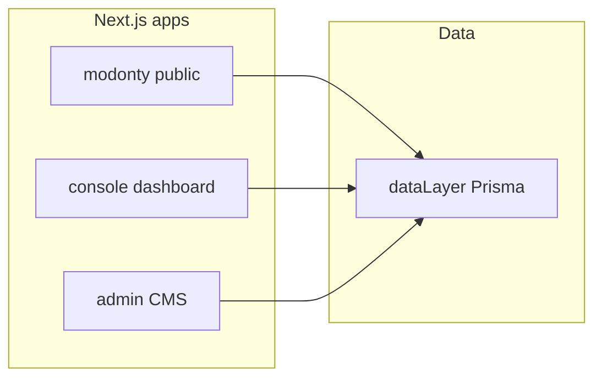

# MODONTY Monorepo — Repository Structure & Component Report

| Field | Value |
|--------|--------|
| **Document** | Repository structure and curated file inventory |
| **Scope** | `modonty/`, `console/`, `admin/`, `dataLayer/`, root workspace |
| **Generated** | 2026-03-29 |
| **Related** | [repo-structure.md](./repo-structure.md) (full file tree, no per-file jobs), [documents/MODONTY_APP_ROUTES_DEEP.md](../documents/MODONTY_APP_ROUTES_DEEP.md), [documents/design/DESIGN_SYSTEM.md](../documents/design/DESIGN_SYSTEM.md) |

**Convention:** Every **curated** path below includes a **Job** line (what the file owns or does). This is not an exhaustive list of every file in the repo.

---

## 1. Executive summary

MODONTY is a pnpm monorepo (`@modonty/monorepo`) with three Next.js applications and one shared database package. **`modonty`** is the public, Arabic (RTL) reader-facing site (feed, articles, clients, categories, auth, APIs). **`console`** is a partner/dashboard app for analytics, support, content, SEO, and campaigns. **`admin`** is the internal CMS for articles, taxonomy, media, users, and platform settings. **`dataLayer`** holds Prisma schema, client, and seeds — the single source of truth for database access across apps.

---

## 2. Monorepo topology

| Package | Path | Stack | Job |
|---------|------|--------|-----|
| `@modonty/modonty` | [modonty/](../modonty/) | Next.js App Router | Public website + REST route handlers under `app/api/` |
| `@modonty/console` | [console/](../console/) | Next.js App Router | Authenticated dashboard (`(dashboard)`), login |
| `@modonty/admin` | [admin/](../admin/) | Next.js App Router | Admin CMS: auth + dashboard CRUD and tools |
| `@modonty/database` | [dataLayer/](../dataLayer/) | Prisma + MongoDB | Schema, generated client, seed scripts |
| Workspace root | [package.json](../package.json) | pnpm + scripts | `dev:*`, `build:*`, Prisma shortcuts |

---

## 3. Shared data layer (`dataLayer/`)

| File / path | Job |
|-------------|-----|
| [dataLayer/package.json](../dataLayer/package.json) | Package metadata; scripts: `prisma:generate`, `prisma:push`, `seed`, `dedupe-before-push`. |
| [dataLayer/prisma/schema/schema.prisma](../dataLayer/prisma/schema/schema.prisma) | Prisma schema — models, relations, enums (authoritative DB contract). |
| [dataLayer/prisma/seed.ts](../dataLayer/prisma/seed.ts) | Database seeding (referenced from package scripts). |
| [dataLayer/index.ts](../dataLayer/index.ts) | Exports Prisma client / DB entry for workspace packages. |

---

## 4. Application: `modonty/` (public site)

### 4.1 Root layout and global assets

| File | Job |
|------|-----|
| [modonty/app/layout.tsx](../modonty/app/layout.tsx) | Root HTML/body, fonts, `TopNav`, `main`, `Footer`, mobile footer, session provider. |
| [modonty/app/globals.css](../modonty/app/globals.css) | Tailwind layers, CSS variables (brand/semantic colors), utilities, global focus/prose/skeleton rules. |
| [modonty/app/page.tsx](../modonty/app/page.tsx) | Home page — feed, sidebars, hero content. |
| [modonty/app/sitemap.ts](../modonty/app/sitemap.ts) | Sitemap generation (if present). |
| [modonty/app/robots.ts](../modonty/app/robots.ts) | Robots.txt rules (if present). |

### 4.2 Routes by domain (`app/**/page.tsx`)

**Home & discovery**

| Route (URL) | File | Job |
|-------------|------|-----|
| `/` | `app/page.tsx` | Home feed and layout. |
| `/trending` | `app/trending/page.tsx` | Trending articles listing. |
| `/search` | `app/search/page.tsx` | Search results UI. |
| `/subscribe` | `app/subscribe/page.tsx` | Newsletter / subscription signup. |

**Articles**

| Route | File | Job |
|-------|------|-----|
| `/articles/[slug]` | `app/articles/[slug]/page.tsx` | Single article: content, sidebar, comments, interactions. |

**Clients**

| Route | File | Job |
|-------|------|-----|
| `/clients` | `app/clients/page.tsx` | Client directory / listing. |
| `/clients/[slug]` | `app/clients/[slug]/page.tsx` | Client profile hub (feed, hero). |
| `/clients/[slug]/about` | `app/clients/[slug]/about/page.tsx` | About section. |
| `/clients/[slug]/contact` | `app/clients/[slug]/contact/page.tsx` | Contact. |
| `/clients/[slug]/followers` | `app/clients/[slug]/followers/page.tsx` | Followers list. |
| `/clients/[slug]/photos` | `app/clients/[slug]/photos/page.tsx` | Photo gallery. |
| `/clients/[slug]/reels` | `app/clients/[slug]/reels/page.tsx` | Reels. |
| `/clients/[slug]/reviews` | `app/clients/[slug]/reviews/page.tsx` | Reviews. |
| `/clients/[slug]/likes` | `app/clients/[slug]/likes/page.tsx` | Likes. |
| `/clients/[slug]/mentions` | `app/clients/[slug]/mentions/page.tsx` | Mentions. |

**Categories**

| Route | File | Job |
|-------|------|-----|
| `/categories` | `app/categories/page.tsx` | All categories. |
| `/categories/[slug]` | `app/categories/[slug]/page.tsx` | Category articles. |

**Users & auth**

| Route | File | Job |
|-------|------|-----|
| `/users/login` | `app/users/login/page.tsx` | Login. |
| `/users/register` | `app/users/register/page.tsx` | Registration. |
| `/users/[id]` | `app/users/[id]/page.tsx` | Public user profile. |
| `/users/profile` | `app/users/profile/page.tsx` | Current user profile overview. |
| `/users/profile/settings` | `app/users/profile/settings/page.tsx` | Account settings. |
| `/users/profile/comments` | `app/users/profile/comments/page.tsx` | User’s comments. |
| `/users/profile/liked` | `app/users/profile/liked/page.tsx` | Liked articles. |
| `/users/profile/disliked` | `app/users/profile/disliked/page.tsx` | Disliked articles. |
| `/users/profile/favorites` | `app/users/profile/favorites/page.tsx` | Saved articles. |
| `/users/profile/following` | `app/users/profile/following/page.tsx` | Following. |
| `/users/notifications` | `app/users/notifications/page.tsx` | Notifications list. |

**Static / marketing / legal**

| Route | File | Job |
|-------|------|-----|
| `/about` | `app/about/page.tsx` | About Modonty. |
| `/contact` | `app/contact/page.tsx` | Contact form. |
| `/terms` | `app/terms/page.tsx` | Terms. |
| `/news` | `app/news/page.tsx` | News listing. |
| `/news/subscribe` | `app/news/subscribe/page.tsx` | News subscribe. |
| `/help` | `app/help/page.tsx` | Help. |
| `/help/faq` | `app/help/faq/page.tsx` | FAQ. |
| `/help/feedback` | `app/help/feedback/page.tsx` | Feedback. |
| `/legal/*` | `app/legal/*/page.tsx` | Cookie, privacy, copyright, user agreement policies. |

### 4.3 API routes (`app/api/**/route.ts`) — grouped

**Auth**

| File | Job |
|------|-----|
| `app/api/auth/[...nextauth]/route.ts` | NextAuth handler (sessions, providers). |

**Articles & interactions**

| File | Job |
|------|-----|
| `app/api/articles/route.ts` | List/create articles (JSON API). |
| `app/api/articles/featured/route.ts` | Featured articles payload. |
| `app/api/articles/[slug]/like/route.ts` | Like article. |
| `app/api/articles/[slug]/dislike/route.ts` | Dislike article. |
| `app/api/articles/[slug]/favorite/route.ts` | Favorite/save article. |
| `app/api/articles/[slug]/view/route.ts` | Record article view. |
| `app/api/articles/[slug]/share/route.ts` | Share tracking. |
| `app/api/articles/[slug]/interactions/route.ts` | Interaction aggregates. |
| `app/api/articles/[slug]/comments/route.ts` | List/create comments. |
| `app/api/articles/[slug]/comments/[commentId]/route.ts` | Single comment mutation. |
| `app/api/articles/[slug]/chat/route.ts` | Article-scoped chatbot API. |

**Chatbot**

| File | Job |
|------|-----|
| `app/api/chatbot/chat/route.ts` | Send chat message. |
| `app/api/chatbot/history/route.ts` | Conversation history. |
| `app/api/chatbot/topics/route.ts` | Topics/suggestions. |

**Clients**

| File | Job |
|------|-----|
| `app/api/clients/route.ts` | Clients list. |
| `app/api/clients/[slug]/route.ts` | Single client by slug. |
| `app/api/clients/[slug]/follow/route.ts` | Follow/unfollow client. |
| `app/api/clients/[slug]/followers/route.ts` | Followers list. |
| `app/api/clients/[slug]/view/route.ts` | Client profile view. |
| `app/api/clients/[slug]/share/route.ts` | Share tracking. |

**Categories & navigation**

| File | Job |
|------|-----|
| `app/api/categories/route.ts` | Categories list. |
| `app/api/categories/[slug]/route.ts` | Category by slug. |
| `app/api/categories/[slug]/analytics/route.ts` | Category analytics. |
| `app/api/navigation/route.ts` | Nav config for clients. |

**Users**

| File | Job |
|------|-----|
| `app/api/users/[id]/route.ts` | Public user profile data. |
| `app/api/users/[id]/stats/route.ts` | User stats. |
| `app/api/users/[id]/comments/route.ts` | User comments. |
| `app/api/users/[id]/liked/route.ts` | Liked articles. |
| `app/api/users/[id]/disliked/route.ts` | Disliked articles. |
| `app/api/users/[id]/favorites/route.ts` | Favorites. |
| `app/api/users/[id]/following/route.ts` | Following. |
| `app/api/users/[id]/activity/route.ts` | Activity feed. |
| `app/api/users/[id]/accounts/route.ts` | Linked accounts. |
| `app/api/users/[id]/settings/route.ts` | User settings read/update. |
| `app/api/users/[id]/settings/password/route.ts` | Password change. |

**Comments & engagement**

| File | Job |
|------|-----|
| `app/api/comments/[id]/like/route.ts` | Like comment. |
| `app/api/comments/[id]/dislike/route.ts` | Dislike comment. |

**Tracking & revalidation**

| File | Job |
|------|-----|
| `app/api/track/analytics/[id]/route.ts` | Analytics event. |
| `app/api/track/article-link-click/route.ts` | Outbound link click. |
| `app/api/track/cta-click/route.ts` | CTA click. |
| `app/api/revalidate/article/route.ts` | On-demand article revalidate. |
| `app/api/revalidate/tag/route.ts` | Tag revalidate. |

**Misc**

| File | Job |
|------|-----|
| `app/api/contact/route.ts` | Contact form submission. |
| `app/api/subscribe/route.ts` | Newsletter subscribe. |
| `app/api/subscribers/route.ts` | Subscribers (admin-facing use). |
| `app/api/news/subscribe/route.ts` | News subscribe. |
| `app/api/suggestions/articles/route.ts` | Article suggestions. |
| `app/api/notifications/route.ts` | Notifications list. |
| `app/api/notifications/[id]/read/route.ts` | Mark notification read. |

### 4.4 Shared components (curated — `modonty/components/`)

| File | Job |
|------|-----|
| `feed/postcard/PostCard.tsx` | Article card shell (schema.org Article). |
| `feed/postcard/PostCardHeader.tsx` | Card header: client, meta. |
| `feed/postcard/PostCardBody.tsx` | Title, excerpt, hero image, read more. |
| `feed/postcard/PostCardFooter.tsx` | Stats row (likes, saves, comments, views, share). |
| `feed/postcard/PostCardHeroImage.tsx` | Optimized featured image with link. |
| `feed/postcard/PostCardAvatar.tsx` | Avatar fallback for feed. |
| `feed/FeedContainer.tsx` | Home feed layout with sidebars. |
| `feed/ArticleFeed.tsx` | Feed wrapper / article list. |
| `feed/TrendingArticles.tsx` | Trending section UI. |
| `feed/infiniteScroll/InfiniteArticleList.tsx` | Infinite scroll + empty/error states. |
| `feed/infiniteScroll/InfiniteFeedSkeleton.tsx` | Loading skeleton for more feed items. |
| `layout/LeftSidebar/LeftSidebar.tsx` | Left column: categories + analytics. |
| `layout/LeftSidebar/AnalyticsCard.tsx` | Category/global analytics widget. |
| `layout/LeftSidebar/CategoriesCard.tsx` | Category list card. |
| `layout/LeftSidebar/CategoryLink.tsx` | Single category link row. |
| `layout/RightSidebar/RightSidebar.tsx` | Right column composer. |
| `layout/RightSidebar/SocialCard.tsx` | Social links. |
| `layout/RightSidebar/ModontyCard.tsx` | “News from Modonty” card. |
| `layout/RightSidebar/NewClientsCard.tsx` | New clients list. |
| `layout/RightSidebar/NewClientItem.tsx` | New client row with avatar. |
| `layout/RightSidebar/NewsItem.tsx` | News line item. |
| `layout/RightSidebar/More.tsx` | Footer links. |
| `layout/RightSidebar/NewsletterSubscribeForm.tsx` | Newsletter form. |
| `layout/Footer.tsx` | Site footer legal links. |
| `layout/BackToTop.tsx` | Scroll-to-top floating button. |
| `layout/SidebarSkeletons.tsx` | SSR skeletons for sidebars. |
| `layout/ScrollProgress.tsx` | Reading progress bar. |
| `navigatore/TopNav.tsx` | Sticky header shell (mobile + desktop). |
| `navigatore/TopNavDesktop.tsx` | Desktop nav grid (logo, links, user area). |
| `navigatore/TopNavWithFavorites.tsx` | TopNav with favorites badge data. |
| `navigatore/MobileFooter.tsx` | Bottom tab bar. |
| `navigatore/MobileFooterWithFavorites.tsx` | Mobile footer + favorites count. |
| `navigatore/NavLinksClient.tsx` | Desktop nav links + SearchLink. |
| `navigatore/DesktopNavItem.tsx` | Single top nav item with active border. |
| `navigatore/nav-link.tsx` | Generic nav link (e.g. drawer). |
| `navigatore/SearchLink.tsx` | Search trigger / compact search. |
| `navigatore/LogoNav.tsx` | Logo link. |
| `navigatore/MobileMenu.tsx` + `MobileMenuClient.tsx` + `MobileMenuTrigger.tsx` | Drawer menu. |
| `auth/UserMenu.tsx` / `UserMenuDropdown.tsx` / `UserAvatarButton.tsx` | Auth avatar and menu. |
| `auth/LoginButton.tsx` | Login CTA. |
| `chatbot/ChatSheet.tsx` + `ChatSheetContainer.tsx` + `ChatTriggerButton.tsx` | Chatbot sheet UI. |
| `chatbot/ArticleChatbotContent.tsx` | Article page chat content. |
| `chatbot/ChatHistoryList.tsx` | History list. |
| `providers/SessionProviderWrapper.tsx` + `SessionContext.tsx` | Session + React context. |
| `notifications/NotificationsBell.tsx` | Notifications icon + popover. |
| `ui/*` | shadcn-style primitives: `button`, `card`, `input`, `dialog`, `breadcrumb`, `avatar`, `skeleton`, etc. |
| `cta-tracked-link.tsx` | Tracked link for analytics. |
| `link/index.tsx` | Next/link wrapper with app defaults. |
| `media/OptimizedImage.tsx` | Cloudinary-aware image helper. |

---

## 5. Application: `console/` (dashboard)

### 5.1 Purpose

Partner/client dashboard: home metrics, analytics, support, subscribers, SEO tools, campaigns, media, content, articles, and profile. Auth via `(auth)/login`.

### 5.2 Routes (`console/app/**/page.tsx`)

| Route | File | Job |
|-------|------|-----|
| `/` | `app/page.tsx` | Entry redirect or landing to dashboard. |
| `/login` | `app/(auth)/login/page.tsx` | Console login. |
| `/dashboard` | `app/(dashboard)/dashboard/page.tsx` | Dashboard home. |
| `/dashboard/analytics` | `app/(dashboard)/dashboard/analytics/page.tsx` | Analytics views. |
| `/dashboard/support` | `app/(dashboard)/dashboard/support/page.tsx` | Support / tickets. |
| `/dashboard/subscribers` | `app/(dashboard)/dashboard/subscribers/page.tsx` | Subscriber management. |
| `/dashboard/leads` | `app/(dashboard)/dashboard/leads/page.tsx` | Leads. |
| `/dashboard/questions` | `app/(dashboard)/dashboard/questions/page.tsx` | Q&A. |
| `/dashboard/settings` | `app/(dashboard)/dashboard/settings/page.tsx` | Settings. |
| `/dashboard/content` | `app/(dashboard)/dashboard/content/page.tsx` | Content overview. |
| `/dashboard/media` | `app/(dashboard)/dashboard/media/page.tsx` | Media library. |
| `/dashboard/campaigns` | `app/(dashboard)/dashboard/campaigns/page.tsx` | Campaigns. |
| `/dashboard/comments` | `app/(dashboard)/dashboard/comments/page.tsx` | Comments moderation. |
| `/dashboard/profile` | `app/(dashboard)/dashboard/profile/page.tsx` | User profile. |
| `/dashboard/articles` | `app/(dashboard)/dashboard/articles/page.tsx` | Articles list. |
| `/dashboard/articles/[articleId]/preview` | `app/(dashboard)/dashboard/articles/[articleId]/preview/page.tsx` | Article preview. |
| `/dashboard/seo` | `app/(dashboard)/dashboard/seo/page.tsx` | SEO hub. |
| `/dashboard/seo/intake` | `app/(dashboard)/dashboard/seo/intake/page.tsx` | SEO intake. |
| `/dashboard/seo/keywords` | `app/(dashboard)/dashboard/seo/keywords/page.tsx` | Keywords. |
| `/dashboard/seo/competitors` | `app/(dashboard)/dashboard/seo/competitors/page.tsx` | Competitors. |

### 5.3 Layout & key UI

| File | Job |
|------|-----|
| `console/app/layout.tsx` | Root layout for console (fonts, providers). |
| `console/app/(dashboard)/layout.tsx` | Dashboard shell: sidebar, header (if present). |
| `console/app/(dashboard)/components/*` | Dashboard-specific components (charts, cards, tables). |

---

## 6. Application: `admin/` (CMS)

### 6.1 Purpose

Internal admin: articles CRUD, SEO analyzer, clients, categories, tags, media, users, analytics, guidelines, Modonty settings, contact messages, export, subscription tiers.

### 6.2 Auth routes

| Route | File | Job |
|-------|------|-----|
| `/login` | `app/(auth)/login/page.tsx` | Admin login. |
| `/forgot-password` | `app/(auth)/forgot-password/page.tsx` | Request reset. |
| `/reset-password` | `app/(auth)/reset-password/page.tsx` | Set new password. |

### 6.3 Dashboard routes (curated by area)

**Core**

| Route | File | Job |
|-------|------|-----|
| `/` (dashboard) | `app/(dashboard)/page.tsx` | Admin home. |
| `/dashboard` | *(same or redirect)* | — |

**Articles**

| Route | File | Job |
|-------|------|-----|
| `/articles` | `app/(dashboard)/articles/page.tsx` | Article list. |
| `/articles/new` | `app/(dashboard)/articles/new/page.tsx` | Create article. |
| `/articles/[id]` | `app/(dashboard)/articles/[id]/page.tsx` | Article detail view. |
| `/articles/[id]/edit` | `app/(dashboard)/articles/[id]/edit/page.tsx` | Edit article. |
| `/articles/preview/[id]` | `app/(dashboard)/articles/preview/[id]/page.tsx` | Preview. |

**Taxonomy & media**

| Routes | Pattern | Job |
|--------|---------|-----|
| `/categories`, `/categories/tree`, `/categories/new`, `/categories/[id]`, `/categories/[id]/edit` | `app/(dashboard)/categories/**/page.tsx` | Category management. |
| `/tags`, `/tags/new`, `/tags/[id]`, `/tags/[id]/edit` | `app/(dashboard)/tags/**/page.tsx` | Tags. |
| `/industries`, `/industries/new`, `/industries/[id]`, `/industries/[id]/edit` | `app/(dashboard)/industries/**/page.tsx` | Industries. |
| `/media`, `/media/upload`, `/media/[id]/edit` | `app/(dashboard)/media/**/page.tsx` | Media library. |

**Clients & users**

| Route | File | Job |
|-------|------|-----|
| `/clients` | `app/(dashboard)/clients/page.tsx` | Client list. |
| `/clients/new` | `app/(dashboard)/clients/new/page.tsx` | New client. |
| `/clients/[id]` | `app/(dashboard)/clients/[id]/page.tsx` | Client detail. |
| `/clients/[id]/edit` | `app/(dashboard)/clients/[id]/edit/page.tsx` | Edit client. |
| `/users` | `app/(dashboard)/users/page.tsx` | Users list. |
| `/users/new` | `app/(dashboard)/users/new/page.tsx` | New user. |
| `/users/[id]` | `app/(dashboard)/users/[id]/page.tsx` | User detail. |
| `/authors` | `app/(dashboard)/authors/page.tsx` | Authors. |

**Ops & analytics**

| Route | File | Job |
|-------|------|-----|
| `/analytics` | `app/(dashboard)/analytics/page.tsx` | Analytics. |
| `/seo-health` | `app/(dashboard)/seo-health/page.tsx` | SEO health. |
| `/subscribers` | `app/(dashboard)/subscribers/page.tsx` | Subscribers. |
| `/export-data` | `app/(dashboard)/export-data/page.tsx` | Data export. |
| `/contact-messages` | `app/(dashboard)/contact-messages/page.tsx` | Inbox list. |
| `/contact-messages/[id]` | `app/(dashboard)/contact-messages/[id]/page.tsx` | Message detail. |
| `/inspect` | `app/(dashboard)/inspect/page.tsx` | Inspect/debug tool. |

**Settings & Modonty**

| Route | File | Job |
|-------|------|-----|
| `/settings` | `app/(dashboard)/settings/page.tsx` | Global settings. |
| `/settings/seed` | `app/(dashboard)/settings/seed/page.tsx` | Seed UI. |
| `/modonty/setting` | `app/(dashboard)/modonty/setting/page.tsx` | Modonty app settings. |
| `/modonty/faq` | `app/(dashboard)/modonty/faq/page.tsx` | FAQ list. |
| `/modonty/faq/new` | `app/(dashboard)/modonty/faq/new/page.tsx` | New FAQ. |
| `/modonty/faq/[id]/edit` | `app/(dashboard)/modonty/faq/[id]/edit/page.tsx` | Edit FAQ. |

**Guidelines**

| Route | File | Job |
|-------|------|-----|
| `/guidelines` | `app/(dashboard)/guidelines/page.tsx` | Guidelines index. |
| `/guidelines/articles`, `clients`, `categories`, `tags`, `authors`, `industries`, `subscribers`, `analytics`, `media`, `gtm` | Under `app/(dashboard)/guidelines/**/page.tsx` | Per-area editorial guidelines. |

**Subscription tiers**

| Route | File | Job |
|-------|------|-----|
| `/subscription-tiers` | `app/(dashboard)/subscription-tiers/page.tsx` | Tiers list. |
| `/subscription-tiers/[id]/edit` | `app/(dashboard)/subscription-tiers/[id]/edit/page.tsx` | Edit tier. |

---

## 7. Cross-cutting

| Area | Job |
|------|-----|
| [documents/](../documents/) | Product specs, SEO, business, integration notes. |
| [docs/](./) | Repo docs, this report, raw tree. |
| Root [package.json](../package.json) | Workspace scripts: `dev:modonty`, `dev:console`, `dev:admin`, Prisma shortcuts. |

---

## 8. Appendix A — Component inventory by app (summary)

### Modonty (public)

- **Feed:** `PostCard*`, `FeedContainer`, `InfiniteArticleList`, `TrendingArticles`, `ArticleCard`.
- **Chrome:** `TopNav*`, `MobileFooter*`, `Footer`, `LeftSidebar`, `RightSidebar`, `BackToTop`, `Breadcrumb`.
- **Auth / session:** `UserMenu*`, `UserAvatarButton`, `SessionProviderWrapper`.
- **Chatbot:** `ChatSheet*`, `ChatTriggerButton`, `ArticleChatbotContent`.
- **Primitives:** `components/ui/*`, `cta-tracked-link`, `link`.

### Console

- Dashboard pages under `console/app/(dashboard)/dashboard/**` — each `page.tsx` owns the screen for that segment (analytics, SEO, support, etc.).
- Shared UI: `console/app/(dashboard)/components/*` and any `console/components/*` (if present).

### Admin

- Dashboard pages under `admin/app/(dashboard)/**` — each `page.tsx` owns that CMS screen (articles, clients, media, settings, guidelines, …).
- Article editor stack: `admin/app/(dashboard)/articles/**/components/*` (large surface; see repo tree).

---

## 9. Appendix B — Full file tree

The machine-generated **complete** path list (all apps, all files) lives in **[repo-structure.md](./repo-structure.md)** (~1300+ lines). It does **not** include per-file **Job** descriptions. Use **this report** for curated paths + jobs; use **repo-structure.md** for exhaustive enumeration.

---

## 10. Diagram (apps ↔ data)

---

*End of report.*
