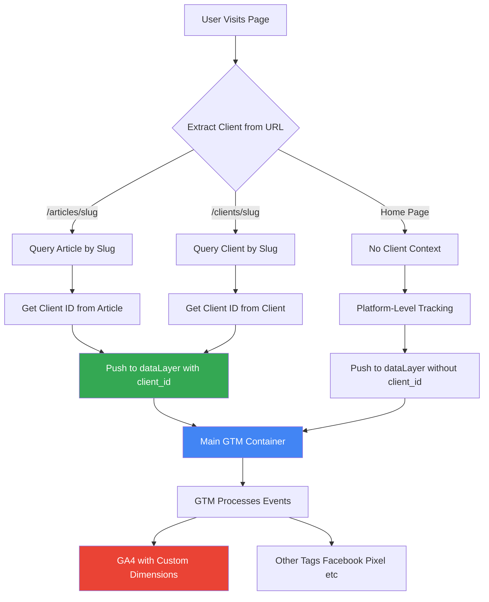

# GTM Multi-Client Implementation Plan

## Architecture



## Key Concepts

1. **Single Main GTM Container**: One GTM container ID loads on all pages
2. **Client-Specific Data Layers**: Each event includes `client_id` as unique identifier
3. **Automatic Client Detection**: Client extracted from URL patterns automatically
4. **Platform-Level Tracking**: Pages without clients still track (no client_id)

## Data Flow

1. **Page Load**
   - GTM container script loads
   - Initial dataLayer initialized

2. **Client Detection**
   - URL analyzed:
     - `/articles/{slug}` → Query Article → Get `clientId`
     - `/clients/{slug}` → Query Client → Get `clientId`
     - Home page → No client

3. **DataLayer Push**
   ```javascript
   window.dataLayer.push({
     event: 'client_context',
     client_id: '507f1f77bcf86cd799439011',
     client_slug: 'techcorp-solutions',
     client_name: 'حلول التقنية المتقدمة',
   });
   ```

4. **Page View Tracking**
   ```javascript
   window.dataLayer.push({
     event: 'page_view',
     page_title: 'Article Title',
     page_location: window.location.href,
     client_id: '507f1f77bcf86cd799439011',
     article_id: '...',
   });
   ```

5. **GTM Processing**
   - GTM reads dataLayer
   - Filters/triggers based on `client_id`
   - Sends to GA4 with custom dimensions
   - Can send to client-specific tags

## Implementation Files

### Files to Create

| File | Purpose |
|------|---------|
| `beta/components/gtm/GTMContainer.tsx` | GTM script injection |
| `beta/helpers/gtm/clientContext.ts` | Client extraction |
| `beta/helpers/gtm/dataLayer.ts` | DataLayer push functions |
| `beta/helpers/hooks/useGTM.ts` | React hook for GTM |
| `beta/helpers/gtm/getGTMSettings.ts` | GTM settings helper |
| Same for `admin/` and `home/` apps | Replicate across apps |

### Files to Modify

| File | Change |
|------|--------|
| `beta/app/layout.tsx` | Add GTMContainer |
| `admin/app/layout.tsx` | Add GTMContainer |
| `home/app/layout.tsx` | Add GTMContainer |
| `beta/app/articles/[slug]/page.tsx` | Push client context |
| `beta/app/clients/[slug]/page.tsx` | Push client context |
| `.env.local` (all apps) | Add `NEXT_PUBLIC_GTM_CONTAINER_ID` |

## DataLayer Structure

```typescript
// Initial dataLayer
window.dataLayer = [
  {
    'gtm.start': new Date().getTime(),
    event: 'gtm.js',
  },
];

// Client context push
window.dataLayer.push({
  event: 'client_context',
  client_id: '507f1f77bcf86cd799439011',
  client_slug: 'techcorp-solutions',
  client_name: 'حلول التقنية المتقدمة',
});

// Page view with client context
window.dataLayer.push({
  event: 'page_view',
  page_title: 'Article Title',
  page_location: window.location.href,
  client_id: '507f1f77bcf86cd799439011',
  article_id: '507f1f77bcf86cd799439012',
});
```

## GTM Configuration

1. **Create Custom Dimension Variables**:
   - `client_id` (Custom Dimension 1)
   - `client_slug` (Custom Dimension 2)
   - `client_name` (Custom Dimension 3)

2. **Create Trigger**:
   - Event: `client_context` or `page_view`
   - Condition: `client_id` is not empty

3. **Configure GA4 Tag**:
   - Send `client_id`, `client_slug`, `client_name` as custom dimensions
   - Fire on page views and custom events

## Settings Priority

1. **Database Settings** (primary): `Settings.gtmContainerId` and `Settings.gtmEnabled`
2. **Environment Variable** (fallback): `NEXT_PUBLIC_GTM_CONTAINER_ID`
3. **Disabled by default**: If neither exists, GTM doesn't load

## Benefits

- Single Container Management: One GTM container for all clients
- Client Segmentation: Each client identified by unique `client_id`
- Flexible Filtering: GTM filters/routes events based on `client_id`
- Scalable: Easy to add more clients without code changes
- Centralized Control: Enable/disable GTM from admin settings

## Testing

1. **Verify GTM Script Loads**: Check Network tab for GTM script
2. **Check dataLayer**: Use console `window.dataLayer`
3. **GTM Preview Mode**: Verify events appear
4. **GA4 Real-Time**: Confirm events reach GA4 with custom dimensions
5. **Client Switching**: Test navigation between different client pages
6. **No Client Pages**: Verify platform-level tracking works
