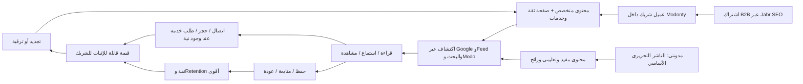
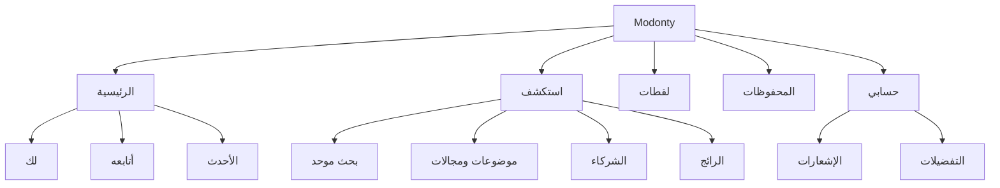
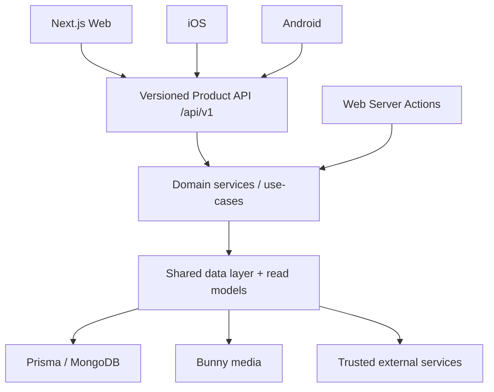

# Modonty Product & UX Master Report

> **المرجع الرئيسي قبل أي تنفيذ UI/UX**  
> الإصدار: 1.0 — 12 أغسطس 2026  
> الحالة: **Research baseline + owner decision gate**  
> النطاق: Modonty Public Web، مع عقود مشتركة للـ Android وiOS مستقبلًا  
> التنفيذ: **لم يبدأ**. هذا المستند يسبق أي تعديل بصري أو معماري.

---

## 0. قرار التقرير في دقيقة واحدة

**مدونتي ليست مدونة تقليدية، وليست دليل شركات، وليست شبكة اجتماعية عامة.** هي منصة اكتشاف محتوى عربي تربط القارئ بمعلومة موثوقة ومفيدة، ثم تربطه — عندما يكون ذلك مناسبًا — بالخبير أو النشاط الذي يمكنه مساعدته. تموّل اشتراكات العملاء التجاريين إنتاج المحتوى والتوزيع، بينما يصنع الاستخدام العام الثقة والظهور والتحويلات التي تدعم تجديد العميل.

التوجه المعتمد المقترح هو:

1. **LinkedIn-inspired product structure، وليس LinkedIn clone:** هيكل تطبيق ثابت، feed مركزي، مصدر محتوى واضح، متابعة وحفظ، ومساحات سياقية؛ مع هوية مدونتي الخاصة وأهدافها التحريرية والتجارية.
2. **قارئ أولًا:** الصفحة العامة تمنح فائدة قبل أن تطلب إنشاء حساب أو اشتراكًا بريديًا.
3. **هويتان لا يجوز خلطهما:**
   - **مدونتي — الناشر التحريري الأساسي:** محتوى مفيد، تعليمي، رائج، ومتعدد المجالات.
   - **الشريك التجاري:** خبرته، نشاطه، خدماته، ومحتواه المتخصص، مع مسار ثقة واتصال أو حجز.
4. **خمسة مقاصد رئيسية ثابتة عبر Web وMobile:** الرئيسية، استكشف، لقطات، المحفوظات، حسابي. البحث أداة عامة، وModo مساعد موجّه، وليسا وجهتي تنقل متنافستين.
5. **عضوية مجانية ≠ تفاعل بالمحتوى ≠ اشتراك عميل B2B.** الحساب المجاني للحفظ والمتابعة والاستئناف؛ الإعجاب إشارة اهتمام بالمحتوى؛ والشريك عميل تجاري. لا نعرض نشرة بريدية في تجربة الزائر.
6. **API-first حقيقي:** Web وAndroid وiOS تستهلك منطق المنتج نفسه وعقودًا مهيأة للإصدارات. الـ Server Actions تبقى غلافًا للويب فقط، وليست مصدر منطق الأعمال.
7. **مؤشر النجاح ليس page views.** المؤشر الشمالي المقترح هو المستخدم الذي يحصل على قيمة ثم يعود في يوم آخر خلال الأسبوع.

إذا اعتمد مالك المنتج القرارات الواردة في §18، يصبح هذا المستند هو مرجع التنفيذ ويحل محل المستند التشخيصي الأولي.

---

## 1. كيف أُنجز هذا التقرير وما درجة الثقة؟

### 1.1 ترتيب مصادر الحقيقة

استخدم التقرير هذا الترتيب عند وجود تعارض:

1. **Prisma schema والكود الحالي**: ما يستطيع المنتج فعله فعليًا.
2. **الموقع الحي صفحة بصفحة**: ما يراه المستخدم الآن، لا ما تقوله الوثائق.
3. **وثائق business model والـ brand الرسمية داخل المشروع.**
4. **مصادر رسمية خارجية**: W3C، Apple، Android، Google، الجهات السعودية والمصرية، وصفحات المساعدة الرسمية للشركات المرجعية.
5. **الافتراضات التصميمية**: تظل فرضيات حتى تختبر مع مستخدمين سعوديين ومصريين.

لا تُستخدم أرقام تسويقية داخلية أو ادعاءات منافسين كحقيقة ما لم تؤيدها جهة رسمية أو بيانات المنتج.

### 1.2 ما تمت مراجعته

- Business model reference، الـ Golden Rules، Brand Guidelines، وتصميمات V3 السابقة.
- Prisma schema بالكامل فيما يخص المستخدم، العميل، المقال، الصوت، الوسائط والـ reels، الحفظ، المتابعة، النشرات، الإشعارات، Modo، والقياس.
- بنية المشروع الحالية: **56 page routes** و**58 API route handlers** وقت المسح.
- النسخة الحية على desktop وmobile للصفحات الأساسية: Home، عميل مدونتي، عميل تجاري، مقال، reels، search، subscribe، register، clients، industries، trending.
- أنماط رسمية من LinkedIn، Medium، Substack، Google News، Apple HIG، Material، W3C، Google Search، Android Architecture، GA4، والجهات السعودية والمصرية.

### 1.3 ما لا نملكه بعد

- لا توجد في المواد التي راجعتها دراسة usability موثقة تبيّن نسبة الضياع أو أسبابها حسب السوق.
- لا يوجد baseline معتمد لـ D1/D7/D28 retention أو search success أو time-to-value.
- لا توجد مقابلات حديثة تفصل احتياجات القارئ السعودي عن المصري.
- بعض كميات المحتوى والـ reels متغيرة حسب قاعدة البيانات، لذلك لا يجوز تصميم المنتج على رقم ثابت.

هذه ليست عوائق لكتابة الاتجاه؛ لكنها تمنع تحويل الفرضيات إلى “حقائق مستخدم” قبل الاختبار.

---

## 2. الفهم الكامل لنموذج الأعمال

### 2.1 الأطراف والقيمة المتبادلة

| الطرف | ما يريد إنجازه | ما تقدمه مدونتي | السلوك الذي يخلق قيمة |
| --- | --- | --- | --- |
| القارئ العربي | الوصول بسرعة إلى معلومة مفيدة وموثوقة أو جهة تساعده، حجز خدمة، أو شراء حقيقي | محتوى مقروء/مسموع/مرئي، بحث، Modo، حفظ ومتابعة، ومسارات نية للخدمة أو التسوق | قراءة، استماع، مشاهدة، بحث ناجح، حفظ، متابعة، حجز، شراء/زيارة متجر، عودة |
| مدونتي كناشر أساسي | بناء عادة وثقة وهوية تحريرية | محتوى واسع مفيد وتعليمي ورائج | متابعة مدونتي، استكشاف موضوعات، عودة للمنصة |
| الشريك/العميل التجاري | الظهور في Google وبناء ثقة وجذب عميل محتمل أو مشتري | صفحة نشاط، محتوى متخصص، خدمات، وقدرات فعلية للحجز أو المتجر أو الموقع | زيارة صفحة الشريك، اتصال، WhatsApp، حجز، زيارة متجر/شراء، متابعة |
| Jabr SEO / المبيعات | بيع وإدارة الاشتراك التجاري | acquisition، pricing، payment، onboarding | اشتراك، تفعيل، تجديد، ترقية |
| فريق التحرير والإدارة | إنتاج محتوى موثوق وضبط الجودة | Admin/Console/workflow | نشر، مراجعة، تحديث، اعتماد |

### 2.2 حلقة القيمة

### 2.3 الـ moat الحقيقي

القيمة التنافسية ليست “عدد المقالات” وحده. هي **شبكة سلطة محتوى مشتركة**:

- المحتوى التحريري لمدونتي يجذب ويعلّم ويبني عادة.
- محتوى الشركاء يضيف عمقًا وخبرة وسياقًا تجاريًا.
- كلما تحسنت تجربة الاكتشاف والثقة والعودة، زادت قيمة الظهور لكل شريك.
- كلما زادت جودة الشركاء والمحتوى، تحسنت فائدة المنصة للقارئ.

لكن هذه الحلقة تنهار إذا بدا كل المحتوى إعلانًا، أو إذا ظهرت مدونتي كعميل تجاري عادي، أو إذا طُلِب التسجيل قبل ظهور الفائدة.

### 2.4 حدود المنتج العام

الـ public experience يجب ألا يتحول إلى:

- شاشة packages أو dashboard عميل.
- feed إعلاني غير مفسّر.
- دليل شركاء تُدفن فيه المعلومة.
- chatbot عام بلا نطاق أو مصادر.
- شبكة UGC مفتوحة؛ الـ reels الحالية مملوكة للعميل وتمر عبر workflow اعتماد.

---

## 3. تعريف المنتج المقترح

### 3.1 الوعد الأساسي

> **“افهم ما يهمك، واحفظه، وارجع له — واعرف الجهة المناسبة عندما تحتاجها.”**

هذا الوعد يجمع المحتوى والاحتفاظ والتحويل من دون أن يجعل القارئ يشعر بأنه دخل إعلانًا.

### 3.2 North-star product statement

**Modonty is an Arabic-first content discovery and trusted-partner platform, personalized by interests and intent, delivered across reading, listening, and short video.**

### 3.3 ما نأخذه من LinkedIn

- App shell ثابت يمكن توقعه.
- feed مركزي هو القلب، وليس carousel من أقسام متنافسة.
- هوية المصدر واضحة قبل المحتوى.
- follow/save/profile states مفهومة ومتكررة.
- desktop context rails تصبح modules داخل تدفق mobile بدل أن تختفي.
- نفس المصطلحات والوجهات على كل شاشة.

### 3.4 ما لا نأخذه من LinkedIn

- اللون أو الـ visual clone.
- feed قائم على النشر الشخصي أو “التفاعل من أجل التفاعل”.
- كثافة الـ social actions قبل قيمة المحتوى.
- infinite scroll غير قابل للتحكم بوصفه الهدف.
- لغة الشبكة المهنية أو creator economy.

**القاعدة:** LinkedIn هو مرجع للـ information architecture والـ behavior؛ Modonty brand هو مرجع الشكل والصوت.

---

## 4. دليل السوق: السعودية ومصر

### 4.1 ما تثبته المصادر السعودية الرسمية

تقرير هيئة الاتصالات والفضاء والتقنية لعام 2024 ذكر أن انتشار الإنترنت بلغ 99% وأن الهاتف المحمول هو الجهاز الأكثر استخدامًا للتصفح بنسبة 99.4%. وأظهرت إحصاءات الهيئة العامة للإحصاء لعام 2025 أن 98.4% يستخدمون الهاتف للوصول للإنترنت، و79.4% يشاهدون الفيديو عبر الإنترنت، و32% يستمعون لمحتوى صوتي، و96.2% يشاركون في شبكات التواصل.

**الاستنتاج المنتجـي:**

- mobile-first ليس preference؛ هو شرط أساسي.
- الفيديو القصير مهم، لكن لا يلغي القراءة.
- الصوت فرصة حقيقية وموجود أصلًا في الـ schema؛ يجب إظهاره عندما يوجد `audioUrl` حقيقي.
- desktop يبقى مهمًا للبحث العميق، قراءة المقالات الطويلة، والمهام التجارية؛ لا نبني “mobile-only”.

### 4.2 ما تثبته المصادر المصرية الرسمية

أعلن الجهاز القومي لتنظيم الاتصالات في 2026 نمو استخدام الإنترنت المحمول 12% مقارنة باليوم نفسه من 2025، مع 7.9 مليون مستخدم محمول جديد، ونمو الإنترنت الثابت 36%. كما بنى تقرير الرضا Q2 2025 على عينات ممثلة جغرافيًا وعمريًا ونوعيًا.

**الاستنتاج المنتجـي:** السوق المصري رقمي ومتنامٍ، لكن الأرقام الرسمية التي راجعناها لا تبرر افتراض أن المصري والسعودي يريدان نسخًا مختلفة جذريًا من التنقل. نستخدم IA واحدة، ثم نختبر اللغة، الأولويات، الأداء، وقنوات العودة مع كل سوق بدل بناء stereotypes.

### 4.3 قرار اللغة

- الواجهة: عربية واضحة ومحايدة وقصيرة، قابلة للفهم في السعودية ومصر.
- نبرة العلامة: واثقة، عملية، غير بيروقراطية، وغير متكلفة.
- المحتوى نفسه يستطيع استخدام نبرة محلية حسب الكاتب والسياق.
- لا نستخدم لهجة محلية في عناصر حرجة مثل الموافقة، الخصوصية، الخطأ، أو الحجز.
- الأسماء المختلطة والروابط ومداخل Modo تستخدم `dir="auto"`.

---

## 5. تشخيص النسخة الحية

### 5.1 الحكم العام

المشكلة الحالية **ليست نقص features**. أغلب القدرات موجودة: صوت، reels، حفظ، متابعة، إشعارات، حسابات، Modo، ومقاييس تفاعل. المشكلة هي أن هذه القدرات لا تتجمع في mental model واحد يستطيع الزائر توقعه.

### 5.2 المشكلات حسب الخطورة

| الأولوية | المشكلة | الدليل الحالي | الأثر المتوقع |
| --- | --- | --- | --- |
| P0 | مدونتي تظهر كعميل/شركة عادية | `/clients/مدونتي` يعرض مراجعات، موقعًا، تواصلًا، ساعات، WhatsApp وشركاء مشابهين | كسر الهوية وفقدان فهم دور المنصة |
| P0 | navigation وdiscovery متنافسان | Search، Modo، categories، tags، industries، partners، trending، sidebars وbottom nav | ضياع وانخفاض الثقة في الاختيار |
| P0 | “مشترك” تعني أكثر من شيء | حساب مجاني أو عميل B2B أو تفاعل محتوى | CTA غير واضح وموافقة غير دقيقة |
| P0 | طلب التسجيل يسبق الفائدة | banner عام قبل أول محتوى على Home | مقاومة التسجيل وانخفاض العودة |
| P0 | APIs موجودة لكنها ليست عقد mobile ثابتًا | 58 route handlers غير versioned، envelopes ورسائل غير موحدة | إعادة بناء عند Android/iOS |
| P1 | mobile فيه طبقات ثابتة متنافسة | bottom nav + Modo floating + CTA/back-to-top حسب الصفحة | حجب المحتوى وأخطاء لمس |
| P1 | Search وModo ليس لكل منهما وظيفة مفهومة | search منفصل وchatbot category-scoped ويطلب login | تردد وفشل وصول للمعلومة |
| P1 | المقال يخلط القراءة والتحويل مبكرًا | actions قبل العنوان وWhatsApp حتى في محتوى مدونتي | قطع التركيز وشعور تجاري مبكر |
| P1 | reels route طريق مسدود عند غياب البيانات | شاشة سوداء فارغة بلا بدائل اكتشاف قوية | dead end وفقدان سياق المنصة |
| P1 | لا توجد حالة منتج لحفظ تقدم القراءة/الاستماع | قياس engagement موجود، لكن ليس `user progress` قابلًا للاستئناف | فقدان سبب عملي للعودة |
| P1 | لا توجد متابعة موضوعات حقيقية | متابعة عميل موجودة، أما الاهتمامات/الموضوعات فليست SSOT للمستخدم | personalization ضعيف |
| P2 | بعض العناوين وH1 مكررة | صفحات عميل وعناوين metadata في المسح الحي | تشويش بصري وSEO |

### 5.3 الصفحة الرئيسية الحالية

Desktop يجمع header كثيفًا، three-column layout، banner تسجيل، feed، اكتشاف تصنيفات، industries، tags، وقائمة طويلة من الشركاء. Mobile يقلص العرض لكنه لا يعيد ترتيب الأولويات؛ فيظل banner التسجيل أولًا ثم feed، مع تنقل ثابت وModo عائم.

**الجذر:** الصفحة تجيب عن “ماذا يوجد عندنا؟” بدل “ماذا تستطيع أن تفعل الآن؟”.

### 5.4 صفحة مدونتي core client

تستخدم قالب الشركة التجارية نفسه. هذا يتعارض مباشرة مع `Settings.coreClientId` ومع الوثيقة التي تصف مدونتي كناشر تحريري. وجودها داخل دليل العملاء يعزز الالتباس.

**القرار:** لا نعتمد على الاسم أو الـ slug. نستخدم `coreClientId` فقط لتحديد الـ core publisher، ونرسم له template مختلفًا، مع استبعاده من partner discovery.

### 5.5 صفحة الشريك

تحتوي قيمة حقيقية: خدمات، فريق، مقالات، مراجعات، ثقة، تواصل وحجز. لكنها تعرض عناصر كثيرة متساوية في الوزن، وعلى mobile قد تظهر ستة أفعال ثابتة في وقت واحد.

**القرار:** صفحة الشريك صفحة conversion مبنية على intent. فعل أساسي واحد وفعل ثانوي واحد حسب capabilities الحقيقية؛ باقي الأفعال داخل overflow أو سياقها.

### 5.6 صفحة المقال

تدعم `audioUrl` فعليًا وتملك مؤلفًا/مراجعًا/citations/lastReviewed، لكن الترتيب الحالي يمنح reactions والتحويل مكانًا مبكرًا. وعندما يكون الناشر هو مدونتي، لا معنى لتحويل القارئ إلى WhatsApp بوصفه عميلًا تجاريًا.

**القرار:** القراءة/الاستماع والثقة أولًا، التفاعل ثانيًا، والتحويل التجاري فقط إذا كان ذا صلة ومصدر المقال شريكًا تجاريًا.

### 5.7 Search وModo

Search الحالي يعيد أنواعًا محدودة وempty state عامًا. Modo لديه RAG، history، مصادر web/DB، واقتراح مقالات، لكنه category-scoped ويطلب حسابًا قبل الاستخدام.

**القرار:**

- Search = استرجاع مباشر معروف النية.
- Modo = يساعد المستخدم غير المتأكد على صياغة حاجته والوصول لمسار أو محتوى موثوق.
- لا يحل أحدهما محل الآخر.
- يُسمح للضيف بتجربة محدودة من Modo مع rate limit؛ الحساب مطلوب للحفظ، التاريخ، والاستئناف، لا لرؤية أول قيمة.

---

## 6. ماذا تفعل الشركات الكبيرة ولماذا؟

| المرجع الرسمي | النمط المفيد | ما نطبقه في مدونتي | ما نتجنبه |
| --- | --- | --- | --- |
| LinkedIn | feed شخصي، follow، save، explanation/controls | shell ثابت، source identity، feed modes، hide/not interested مستقبلًا | نسخ الشكل أو شبكة النشر الشخصي |
| Medium | publications، following، reading list، notification preferences | مدونتي كـ publication، مكتبة محفوظات، وتفضيلات إشعارات واضحة | خلط العضوية بخدمة قديمة غير معروضة |
| Substack | Home queue، Inbox، Saved، Audio، subscriptions | مركز عودة للمحفوظات والصوت ومتابعة المصادر | تحويل المنتج إلى صندوق بريد فقط |
| Google News | For You مقابل Following مع تحكم بالاهتمامات والمصادر | تبويب “لك” و“أتابعه” وسبب ظهور المحتوى | personalization غامض بلا تحكم |
| Apple HIG + Material | 3–5 وجهات top-level ثابتة؛ tab bar للتنقل لا للأفعال | خمسة مقاصد ثابتة Web/Mobile | وضع Modo أو Subscribe كـ tab |
| W3C | تنقل متسق، أكثر من طريقة للعثور، bidi صحيح | labels ثابتة، search + browse، RTL منطقي | تغيير معنى/ترتيب الوجهة حسب الصفحة |
| Google Search | تجنب interstitials التي تحجب المحتوى | CTA inline بعد value moment | popup تسجيل مبكر أو app-install مزعج |

**الخلاصة:** المنتجات الناجحة لا تعرض كل feature في أول شاشة. هي تثبت “مكان المستخدم”، ثم تقدم خطوة تالية يمكن توقعها، ثم تجعل العودة ذات قيمة من خلال follow/save/history/preferences.

---

## 7. Information Architecture النهائية المقترحة

### 7.1 الوجهات الخمس

| الترتيب | الاسم العام | وظيفته الوحيدة | يتضمن |
| --- | --- | --- | --- |
| 1 | **الرئيسية** | ما يهم المستخدم الآن وما يمكن استئنافه | لك، أتابعه، الأحدث، continue، core spotlight |
| 2 | **استكشف** | الانتقال من نية عامة إلى محتوى أو مجال أو خدمة أو شراء | Search، موضوعات، مجالات، شركاء، رائج، احجز الآن، تسوق |
| 3 | **لقطات** | تعلم/اكتشاف قصير مرئي مرتبط بسياق | Reels، transcript، publisher، related article |
| 4 | **المحفوظات** | قيمة محفوظة للعودة | مقالات، صوت، لقطات، قوائم/لاحقًا |
| 5 | **حسابي** | الهوية والتفضيلات والنشاط | profile، following، notifications، settings |

اسم route يبقى `/reels` لحماية التوافق؛ اسم الواجهة الموصى به **لقطات**. تغييره لاحقًا copy decision وليس تغيير architecture.

### 7.2 الأدوات العامة وليست وجهات

- **Search:** متاح من الـ app bar وداخل Explore.
- **Notifications:** utility للحساب، لا وجهة رئيسية مستقلة في bottom nav.
- **Modo:** composer/assistant داخل Home وExplore والمقال، لا floating layer دائمة على كل شاشة.
- **Subscribe/Create account:** conversion، لا navigation.

### 7.3 خريطة مختصرة

### 7.4 desktop shell

عند `xl` يمكن استخدام روح LinkedIn بثلاثة أعمدة، بشرط ألا تصبح الأعمدة الثلاثة ثلاثة منتجات:

- **العمود المركزي:** feed أو محتوى route، وهو الأكبر دائمًا.
- **الـ rail الأقرب لبداية القراءة RTL:** هوية/توجيه: core Modonty، interests، عناصر Explore مختصرة.
- **الـ rail الآخر:** continue/saved/relevant partner/trending حسب السياق، من دون إعادة navigation.

عند أحجام أقل يصبح التخطيط عمودين ثم عمودًا واحدًا. لا يوجد محتوى أساسي متاح على desktop ويختفي على mobile؛ يتحول إلى module داخل التدفق.

### 7.5 mobile shell

- App bar بسيط: logo/route title + search utility + account/notification حسب الحالة.
- Bottom navigation واحدة للوجهات الخمس.
- لا يظهر Modo floating button وBack-to-top وsticky CTA فوق bottom nav في الوقت نفسه.
- في صفحات التحويل: sticky bar بفعل أساسي وثانوي فقط.
- في fullscreen reel: back، publisher، mute/captions، وعودة واضحة للسياق؛ لا شاشة سوداء منفصلة عن المنتج.

---

## 8. مخطط الصفحة الرئيسية

### 8.1 ترتيب القيمة

1. **توجيه فوري:** ماذا تقدم مدونتي + سؤال/نية بسيطة.
2. **Modo composer:** “إيش حاب تعرف اليوم؟” مع أمثلة قصيرة؛ لا حقل يشبه Search دون تفسير.
3. **Interests optional:** اختيار سريع قابل للتخطي والتعديل، لا onboarding إجباري.
4. **مدونتي الناشر الأساسي:** module مميز وواضح يظهر على desktop وmobile بالهوية نفسها.
5. **Feed mode:** لك / أتابعه / الأحدث.
6. **Feed:** cards متعددة الصيغة بقواعد موحدة.
7. **Contextual value:** استئناف، محفوظات، أو شريك مرتبط عند الحاجة.

لا يتصدر التسجيل الصفحة. يظهر إنشاء الحساب عند أول محاولة حفظ/متابعة/استئناف، أو بعد استهلاك مفيد، مع شرح المنفعة.

### 8.2 بطاقة مدونتي

**Invariant عبر الشاشات:**

- الاسم: مدونتي.
- الوصف: “الناشر التحريري للمنصة” وليس اسم شخص أو مؤسس.
- وعد قصير: محتوى عربي مفيد وموثوق عبر مجالات متعددة.
- أفعال: “تابع مدونتي” و“استكشف الجديد”.
- badge واضح: “من مدونتي” أو “تحرير مدونتي”.

Desktop قد يعرضها كـ compact rail card. Mobile يعرضها كـ horizontal/inline module بعد Modo أو interests. اختلاف الحجم مسموح؛ اختلاف الفكرة أو اختفاؤها غير مسموح.

### 8.3 بطاقة المحتوى الموحدة

يجب أن تجيب قبل الضغط عن:

- من المصدر؟ مدونتي أم شريك؟
- ما الصيغة؟ قراءة، استماع متاح، أو لقطة؟
- لماذا يهمني؟ عنوان واضح + excerpt قصير أو سبب ظهور.
- ما الزمن المتوقع؟ reading time أو duration حقيقي فقط.
- ما الإجراء الأقرب؟ فتح، حفظ، مشاركة؛ التعليقات والإعجاب ثانوية.

لا نعرض badge صوت إذا لم يوجد `audioUrl`، ولا مدة fabricated، ولا “موثّق” بلا تعريف ودليل.

### 8.4 feed logic الأولي

قبل وجود personalization model كامل:

- الضيف: mix واضح من مدونتي + محتوى شركاء عالي الجودة، مع “الأحدث” و“الرائج” كإشارتين منفصلتين.
- بعد اختيار interests: يزيد وزن الموضوعات المختارة مع إمكانية “لماذا أرى هذا؟”.
- العضو: following + saved/progress + behavior، لكن explicit choices تتقدم على inference.
- كل batch يحتفظ بالتنوع ولا يتحول إلى عشرة عناصر من عميل واحد.

الخوارزمية نفسها تحتاج ranking spec منفصل قبل التنفيذ؛ الـ UI لا يخترع ranking.

---

## 9. مخطط هويتي Client

### 9.1 CorePublisherPage لمدونتي

يبقى `Settings.coreClientId` هو SSOT. لا نستخدم string comparison.

**الترتيب:**

1. هوية الناشر ورسالة التحرير.
2. موضوعات مدونتي واختياراتها.
3. أحدث/أهم المحتوى حسب الصيغة.
4. series أو collections عند توفرها.
5. follow + newsletter preference منفصلان.
6. معلومات الثقة والسياسة التحريرية.

لا تظهر: ساعات عمل، موقع متجر، حجز، “شركاء مشابهون”، تقييم نشاط تجاري، أو WhatsApp عام ما لم يوجد use case تحريري موثق.

الحفاظ على URL الحالي مؤقتًا أفضل من كسر SEO. يمكن لاحقًا تقديم `/modonty` كعنوان branded مع canonical/redirect مدروس، لكنه ليس شرط refactor الأول.

### 9.2 BusinessClientPage للشريك

**الترتيب:**

1. الهوية + المجال + جملة قيمة واحدة.
2. trust signals حقيقية وقابلة للتفسير.
3. فعل أساسي حسب capability الحقيقية: حجز أو تسوق أو تواصل أو زيارة الموقع.
4. الخدمات/الخبرة.
5. محتوى الشريك.
6. الفريق/الإنجازات/المراجعات إذا وجدت.
7. FAQ ومعلومات الاتصال.
8. شركاء ذوو صلة في النهاية فقط.

Mobile sticky CTA: فعل أساسي + ثانوي. Save/share/review داخل menu أو مواضعها الطبيعية.

### 9.3 قدرات العميل ومسارات النية

العميل لا يُعرض بوصفه “بطاقة عامة”؛ بل ككيان له capabilities يقرأها الـ UI من البيانات الحقيقية. لا يظهر زر ولا route intent إلا عندما تتوافر القدرة الفعلية والرابط أو إعداد الخدمة الصحيح.

| نية الزائر | من يظهر له | الفعل الأساسي في البطاقة | شرط الثقة قبل التحويل |
| --- | --- | --- |
| **احجز الآن** | العملاء الذين يملكون حجزًا متاحًا | احجز الآن | الخدمة، الوقت/آلية الحجز، والبيانات المطلوبة واضحة |
| **تسوّق** | العملاء الذين يملكون متجرًا أو رابط شراء حقيقيًا | تسوّق / زيارة المتجر | اسم المتجر/الوجهة واضح، ولا ندّعي وجود checkout داخل مدونتي ما لم يكن موجودًا |
| **تواصل مع خبير** | العملاء القابلون للتواصل عبر قناة حقيقية | تواصل | channel واضح وسياسة استخدام البيانات واضحة |
| **زيارة الموقع** | العملاء الذين لديهم موقع موثق في البيانات | زيارة الموقع | انتقال خارجي معلن بوضوح |
| **استكشف حسب المجال** | العملاء والمحتوى ذوو الصلة بالمجال | استكشف | لا يُفترض intent تجاري قبل أن يختاره الزائر |

ترتيب الأولوية لا يُخمن من نوع العميل أو اسمه: `booking` يتقدم عندما يكون متاحًا وملائمًا للنية، ثم `commerce`، ثم `contact`، ثم `website`. عند تعدد القدرات يظهر فعل واحد رئيسي وفعل ثانوي واحد؛ الباقي داخل قائمة “المزيد”.

### 9.4 YMYL قبل التحويل

العميل في مجال YMYL (مثل الصحة أو المال أو القانون) قد يملك حجزًا أو متجرًا، لكن لا يكفي ذلك لإظهار CTA قوي. قبل التحويل تعرض الصفحة والبطاقة — بحسب البيانات الحقيقية — التخصص أو الترخيص/الاعتماد القابل للتحقق، اسم مقدم الخدمة، آخر مراجعة للمحتوى، الإفصاح المناسب، والتنبيه المعلوماتي عند الحاجة. لا تُنشأ شارة ثقة أو صياغة علاجية/مالية/قانونية من دون دليل في البيانات والمراجعة المختصة.

### 9.5 الإفصاح

المستخدم يجب أن يعرف أن المحتوى مرتبط بعميل مدفوع دون إضعاف قيمة المقال. الصيغة المقترحة:

> “محتوى متخصص بالتعاون مع [اسم الشريك]، خضع لمراجعة مدونتي.”

تُستخدم فقط إذا كانت تعكس workflow الحقيقي. السياسة التحريرية يجب أن تشرح الفصل بين الدفع والادعاءات التحريرية.

---

## 10. مخطط المقال: اقرأ أو استمع

### 10.1 ترتيب الصفحة

1. Breadcrumb مختصر.
2. source identity + badge core/partner.
3. H1 واحد.
4. وصف وmetadata: تاريخ، تحديث، reading time، author/reviewer.
5. switch “اقرأ / استمع” **فقط** إذا يوجد `audioUrl`.
6. صورة/وسيط رئيسي.
7. جدول محتويات اختياري للمقالات الطويلة.
8. body بقراءة مريحة.
9. citations، reviewer، freshness، والتوضيحات المهمة في السياق.
10. save/share/reaction بطريقة غير مقاطعة.
11. related content.
12. partner CTA فقط إذا كان ذا صلة.

### 10.2 الصوت

- نفس الـ article id، وليس كيان محتوى منفصلًا يشتت analytics.
- progress قابل للحفظ والاستئناف عبر الأجهزة للعضو.
- speed، seek، elapsed/remaining، transcript/reading fallback.
- لا autoplay.
- إذا فشل الصوت تبقى القراءة متاحة بلا dead end.
- native لاحقًا يستطيع background playback من العقد نفسه.

### 10.3 الثقة وYMYL

في الصحة والمال والقانون وما شابه:

- اسم الكاتب وصفته.
- المراجع المختص وتاريخ المراجعة عند وجودهما.
- last reviewed/date modified.
- citations مباشرة.
- تنبيه أن المحتوى معلوماتي عندما يلزم.
- لا badge “موثّق من Google” بمعنى endorsement؛ analytics أو الظهور ليسا اعتمادًا من Google.

### 10.4 منع تحويل المقال إلى إعلان

- لا WhatsApp قبل أن يصل القارئ إلى إجابة.
- لا CTA تجاري في core Modonty article إلا use case محدد.
- لا أكثر من CTA أساسي واحد في viewport.
- signup prompt inline بعد save/follow intent أو value moment، لا modal حجب.

---

## 11. Search وModo وExplore

### 11.1 Search

وظيفته: استرجاع شيء يعرف المستخدم أنه يريده.

**النتائج الموحدة:** Articles، Partners، Topics/Categories، Authors، Reels. تعرض النتائج grouped أو blended مع type filters بسيطة. Search suggestions تأتي من بيانات حقيقية، لا نصوص وهمية.

**Empty state مفيد:**

- تصحيح/اقتراح query.
- موضوعات رائجة ذات صلة.
- الانتقال إلى Modo بصيغة “ساعدني أصيغ سؤالي”.
- لا صفحة فارغة تقول “ابدأ البحث” فقط.

### 11.2 Modo

الاسم المعتمد: **Modo** — أول أربعة أحرف من مدونتي وفق قرار المالك.

وظيفته: فهم نية غير واضحة، طرح سؤال تضييق واحد عند الحاجة، وإرجاع جواب موثّق + مسارات ومقالات. ليس chat عام ولا بديل SEO.

**قواعد:**

- يوضح نطاقه ومصدر الجواب.
- يقدم citations وروابط داخل مدونتي.
- يميز جواب DB عن web source.
- يعرض “لا أعرف/مصادر غير كافية” بوضوح.
- يحفظ history فقط للعضو وبعد موافقة/سياسة واضحة.
- guest preview محدود مع rate limit؛ لا registration wall قبل أول فائدة.
- نقيس outcome: answer، redirect، no sources، out of scope، error.

### 11.3 Explore

Explore لا يعرض taxonomy كاملة دفعة واحدة. يبدأ بـ:

1. Search.
2. نية واضحة: **استكشف محتوى**، **احجز الآن**، **تسوّق**، **تواصل مع خبير**، أو **زيارة موقع**.
3. موضوعات مختارة أو اهتمامات المستخدم.
4. رائج الآن.
5. شركاء حسب المجال/الحاجة والقدرة المختارة.
6. categories/industries/tags كآليات تصفية داخل السياق.

يجب مراجعة taxonomy الحالية لأن وجود categories وindustries وtags متشابهة أمام المستخدم يضاعف الخيارات. يمكن الاحتفاظ بها في data/SEO مع تبسيط presentation إلى “موضوعات” و“مجالات”.

#### سلوك مسارات الحجز والتسوق

- **احجز الآن:** يفتح listing مفلترًا مسبقًا للعملاء ذوي capability الحجز؛ يبقى المجال، الموقع، السعر/المدى، والتوقيت فلاتر اختيارية فقط عندما تكون بياناتها حقيقية.
- **تسوّق:** يفتح listing مفلترًا للعملاء ذوي متجر أو purchase URL. إذا كان الشراء خارج مدونتي، يقال “زيارة المتجر” ويقاس outbound click؛ لا نسمّيه “شراء” داخل المنصة.
- **عند عدم وجود نتائج:** لا dead end. نعرض أقرب بديل: “استكشف الخبراء في هذا المجال”، “اطلب التواصل”، أو محتوى يساعد على اتخاذ القرار.
- لا يعرض الموديل أي عميل خارج capability المختارة لمجرد دفعه أو كونه featured؛ النية التي اختارها المستخدم أعلى من الترويج.

---

## 12. لقطات / Reels

### 12.1 الدور

الـ reel ليس جزيرة ترفيه. هو مدخل قصير إلى فكرة، ناشر، مقال، أو شريك.

### 12.2 كل لقطة تعرض

- publisher/client identity.
- topic.
- caption قصير.
- transcript/captions عند توفرها، مع حالة فشل واضحة.
- duration حقيقي.
- save، follow، share، comments بحسب الحالة.
- “اقرأ التفاصيل” إذا يوجد `reelArticleId`.

### 12.3 السلوك

- vertical paging مع play/pause/mute/captions.
- لا autoplay بصوت.
- احترام `prefers-reduced-motion`.
- حفظ progress/complete analytics.
- بعد عدة لقطات، اقتراح محتوى عميق لا مزيد من scroll فقط.

### 12.4 empty state

إذا لا توجد reels منشورة:

- يبقى app shell والتنقل.
- تظهر مقالات تحتوي فيديو أو محتوى مرئي ذو صلة إن وجد.
- CTA إلى Home/Explore محدد.
- لا شاشة سوداء منفصلة.

---

## 13. العضوية والاشتراك والاحتفاظ

### 13.1 قاموس إلزامي

| المفهوم | الاسم العربي | CTA الصحيح | لا يُسمى |
| --- | --- | --- | --- |
| Anonymous visitor | زائر / قارئ | — | مشترك |
| Free account | عضو مدونتي / حساب مجاني | أنشئ حسابًا مجانيًا | اشترك |
| In-app source/topic relation | متابعة | تابع | اشترك |
| Content reaction | إعجاب | أعجبني | عضو أو شريك |
| Paid business | شريك / عميل مدفوع داخليًا | انضم كشريك / نمِّ ظهور نشاطك | مشترك عام |

### 13.2 ماذا يفتح الحساب المجاني؟

- حفظ عبر الأجهزة.
- متابعة مدونتي والشركاء والموضوعات.
- feed “أتابعه”.
- استئناف القراءة والاستماع.
- history وتفضيلات Modo.
- إشعارات يمكن التحكم بها.

إذا لم نستطع تقديم هذه القيمة فعليًا، لا نعد بها في التسجيل.

### 13.3 متى نطلب الحساب؟

بعد intent واضح:

- ضغط حفظ.
- متابعة.
- استئناف على جهاز آخر.
- الاحتفاظ بمحادثة Modo.
- تخصيص دائم.

الـ prompt يشرح الفائدة المباشرة: “أنشئ حسابًا مجانيًا لتحفظ هذا المقال وتكمله لاحقًا.”

### 13.4 البريد الإلكتروني في الواجهة العامة

- لا توجد نشرة بريدية أو CTA للاشتراك بالبريد في تجربة الزائر أو العضو ضمن هذا refactor.
- تُجمَّد البنى والبيانات البريدية الموجودة؛ لا تُحذف ولا تُعرض ولا تُبنى عليها رحلة احتفاظ جديدة.
- الاحتفاظ المنتجـي يعتمد على الحفظ والمتابعة واستئناف القراءة والإشعارات داخل التطبيق عند تنفيذها فعليًا.

### 13.5 retention loops

1. **Save loop:** محتوى مفيد → حفظ → تذكير/مكتبة → عودة.
2. **Follow loop:** متابعة موضوع/مصدر → feed “أتابعه” → جديد واضح → عودة.
3. **Progress loop:** بدأ قراءة/استماع → continue card → استكمال.
4. **Digest loop:** تفضيلات صريحة → digest مفيد بتكرار مختار → deep link.
5. **Series loop:** محتوى ضمن سلسلة → التالي المنطقي → استكمال وعودة.
6. **Service loop:** محتوى متخصص → partner trust → سؤال/حجز → متابعة الحالة.

لا تستخدم الإشعارات كتعويض عن feed ضعيف.

---

## 14. النظام البصري والـ RTL

### 14.1 Brand application

- Dark Navy `#0e065a`: الهوية والأسطح الرئيسية والـ primary emphasis.
- Royal Blue `#3030ff`: الأفعال الأساسية والحالة النشطة.
- Cyan `#00d8d8`: accent محدود، status، أو detail بصري؛ ليس لكل زر.
- Tajawal للعربية وMontserrat للاتينية.
- القيم: sleek، purposeful، bold، reliable؛ لا زخرفة بلا وظيفة.

### 14.2 Theme decision

**الموصى به:** reading surfaces فاتحة افتراضيًا لصفحات المحتوى، مع dark mode اختياري ومحفوظ. يمكن استعمال navy في shell والـ branded modules. لا نفرض dark full-canvas على المقالات الطويلة أو الـ empty states.

هذا يحافظ على صورة حديثة شبيهة بتطبيقات المحتوى ويعطي أولوية للقراءة، مع احترام من يفضل dark.

### 14.3 component behavior

- shadcn/ui أولًا، ثم wrappers تحمل Modonty variants؛ لا fork عشوائي للمكونات الأصلية.
- radius وshadow restrained؛ البطاقات ليست bubbles منفصلة لكل سطر.
- 44px touch target كهدف عملي للأفعال الرئيسية.
- labels بجانب الأيقونات للأفعال الحرجة.
- skeleton يطابق الشكل النهائي لتقليل CLS.
- empty/error/loading/auth states جزء من spec وليس cleanup لاحقًا.

### 14.4 RTL non-negotiables

- `dir="rtl"` في root الصحيح.
- CSS logical properties وTailwind `start/end/ms/me/ps/pe`.
- `dir="auto"` للأسماء، queries، chat، URLs، وأي UGC.
- directional icons تنعكس، أما logos/media controls فلا تُقلب بلا معنى.
- تواريخ وأرقام عبر `Intl` وبـ locale واضح، لا concatenation يدوي.
- اختبارات نص عربي + English acronym + رقم + URL في كل component نصي رئيسي.

### 14.5 responsive invariants

نختبر على الأقل 360، 390، 430، 768، 1024، 1280، و1440px. ما يتغير هو presentation؛ ما لا يتغير:

- أسماء الوجهات ومعانيها.
- هوية المصدر.
- ترتيب القيمة الأساسي.
- availability للأفعال.
- loading/error/empty semantics.

---

## 15. Architecture: API-first دون إعادة بناء لاحقًا

### 15.1 الواقع الحالي

وجود 58 API handlers بداية قوية، لكنه لا يساوي mobile-ready contract. المسح أظهر:

- endpoints غير versioned.
- envelopes ورسائل خطأ غير متسقة.
- بعض أسماء قاعدة البيانات لا تطابق معنى المنتج (`ClientLike` مستخدمة كمتابعة).
- بعض قدرات الويب عبر Server Actions أو route-specific behavior.
- لا read model موحد للـ feed متعدد الصيغ.

### 15.2 المعمارية المستهدفة

**القاعدة:** Web وAPI يستعملان domain service نفسها. لا يكرر route business logic، ولا يتصل native مباشرة بقاعدة البيانات.

### 15.3 نوع العقد

REST JSON versioned موصى به للحد المشترك بين TypeScript Web وSwift/Kotlin، مع OpenAPI document كمرجع قابل للتوليد والاختبار. يمكن أن يبقى tRPC لسيناريوهات TypeScript داخلية، لكنه ليس عقد Android/iOS الرئيسي.

### 15.4 قواعد العقد

- prefix: `/api/v1`.
- cursor pagination للـ feed والـ reels، لا offset في تدفقات متغيرة.
- stable IDs مع slug للعرض/SEO.
- resource capabilities من السيرفر: `canListen`, `canBook`, `canContact`, `canFollow`, `canSave`.
- envelope نجاح ثابت: `data`, و`meta/links` عند الحاجة.
- envelope خطأ ثابت: `error.code`, `error.message`, `fieldErrors?`, `requestId`.
- machine-readable codes ثابتة، والرسالة localized حسب locale.
- idempotency للـ save/follow/progress والمutations الحساسة.
- auth واضح للضيف/العضو، rate limiting، وعدم كشف secrets.
- ETag/cache semantics للقراءات العامة، وعدم caching بيانات الحساب.
- backward compatibility داخل الإصدار؛ breaking change = إصدار جديد.

### 15.5 العقود الأساسية المقترحة

| المجال | Endpoints منطقية مقترحة | المستهلكون |
| --- | --- | --- |
| Home feed | `GET /api/v1/feed?mode=for_you|following|latest&cursor=` | Web/iOS/Android |
| Explore | `GET /api/v1/explore` | الجميع |
| Intent listings | `GET /api/v1/discovery/clients?intent=book|shop|contact|website&industry=&cursor=` | الجميع |
| Search | `GET /api/v1/search?q=&types=&cursor=` | الجميع |
| Article | `GET /api/v1/articles/{slug}` | الجميع |
| Partner/Core | `GET /api/v1/publishers/{slug}` أو resource discriminated عبر client endpoint؛ يعيد `publisherType` و`capabilities` | الجميع |
| Reels | `GET /api/v1/reels?cursor=` | الجميع |
| Saved | `GET /api/v1/me/saved`; `PUT/DELETE /api/v1/me/saved/{type}/{id}` | عضو |
| Follows | `GET /api/v1/me/follows`; `PUT/DELETE /api/v1/me/follows/{type}/{id}` | عضو |
| Interests | `GET/PUT /api/v1/me/interests` | عضو |
| Progress | `PUT /api/v1/me/progress/{type}/{id}`; `GET /api/v1/me/continue` | عضو |
| Notifications | `GET /api/v1/me/notifications`; read/preferences | عضو |
| Email legacy | endpoints البريد الموجودة تبقى خارج نطاق UI الجديد حتى قرار منتج مستقل | — |
| Modo | threads/messages/history + streamed response | ضيف محدود/عضو |

هذه عقود product وليست تعليمات لعمل migration الآن. لا تُنشأ حتى يعتمد read models والـ naming.

### 15.6 read models المشتركة

- `ContentCard`: discriminated type (`article | audio_article | reel`) + publisher + topic + media + metrics + viewer state + reason.
- `ArticleDetail`: body، audio، trust، related، CTA capabilities.
- `PublisherSummary`: `publisherType: core | partner` يمنع تخمين الهوية في UI.
- `PartnerDetail`: services، trust، YMYL disclosure، وcapabilities (`canBook`, `canShop`, `canContact`, `canVisitWebsite`) مع URLs/actions الحقيقية.
- `ViewerState`: saved/following/progress/authenticated.
- `PageState`: cursor، empty reason، recoverable error.

### 15.7 فجوات البيانات

| القدرة | الموجود | الفجوة/القرار |
| --- | --- | --- |
| حساب المستخدم | `User`, Account, Session | مناسب كبداية |
| حفظ مقال | `ArticleFavorite` | يوحّد خلف Saved API |
| حفظ reel | `MediaReaction(FAVORITE)` | يوحّد خلف العقد نفسه |
| متابعة client | `ClientLike` | لا نغير DB فورًا؛ adapter يسميها follow في domain |
| متابعة موضوع | غير واضحة كحالة مستخدم | تحتاج model/contract بعد الاعتماد |
| الاهتمامات | لا يوجد SSOT مخصص | تحتاج user preference model |
| progress | Analytics/EngagementDuration للقياس | لا تستخدم analytics كحالة منتج؛ نحتاج `UserContentProgress` |
| email legacy | `Subscriber` و`NewsSubscriber` | تُترك كما هي؛ لا surface عام ولا توسيع نطاق دون قرار مستقل |
| Modo history | `ChatbotMessage` category/article scoped | يحتاج thread + scope موحد للمنتج |
| صوت | `Article.audioUrl` | موجود؛ نضيف progress/capabilities فقط |
| reels | Media workflow + transcript + article link | موجود وقابل لإعادة الاستخدام |
| الحجز/المتجر/الموقع | booking وبعض روابط العميل موجودة بحسب بيانات العميل | نعرّف capability adapter موحدًا أولًا؛ لا نفترض shop أو booking من اسم العميل |

أي تعديل Prisma هو phase مستقل ويحتاج موافقة صريحة، migration plan، backup، وrollback. لا تعديل قاعدة بيانات ضمن UI refactor تلقائيًا.

---

## 16. القياس: كيف نعرف أننا أصلحنا الضياع والاحتفاظ؟

### 16.1 المؤشر الشمالي

**Weekly Returning Value Users (WRVU)**  
عدد الأشخاص الفريدين الذين حققوا “جلسة ذات قيمة” في يومين مختلفين على الأقل خلال سبعة أيام.

جلسة القيمة تتحقق بواحد من:

- قراءة أو استماع ≥60% من محتوى.
- إكمال reel ثم فتح المحتوى العميق المرتبط.
- search ناجح: query → result select → engagement مفيد.
- حفظ أو متابعة بعد استهلاك محتوى.
- conversion مؤهل إلى شريك.

هذا التعريف يجمع “الفائدة” و“العودة”، ويصعب تحسينه بمجرد زيادة impressions.

### 16.2 المقاييس المساندة

| الهدف | المقياس |
| --- | --- |
| تقليل الضياع | task success، first-click success، backtracking، search refinements |
| تقليل وقت الوصول | time to first value من landing حتى استهلاك/اختيار مفيد |
| نجاح Search | search success rate، zero-result rate، result CTR، post-click engagement |
| نجاح Modo | answer/redirect/noSources/outOfScope/error + downstream engagement |
| Activation | أول save/follow/progress أو ثاني useful session بعد إنشاء الحساب |
| Retention | D1/D7/D28 وweekly cohorts حسب السوق والجهاز والمصدر |
| الإعجاب | نسبة التفاعل المفيد لكل جلسة، مع الحفظ والمتابعة؛ لا يُعامل كبديل للموافقة التسويقية |
| Partner value | qualified contact/booking وليس WhatsApp click وحده |
| الأداء | p75 LCP ≤2.5s، INP ≤200ms، CLS ≤0.1 |
| الجودة | error rate، empty dead ends، rage clicks، duplicate CTA interactions |

### 16.3 event contract

الكود الحالي يملك registry قويًا للمقالات والعملاء والحجز والتسجيل وWeb Vitals، لكنه يفتقد حلقة الاكتشاف والاحتفاظ.

**نحافظ على التاريخ الحالي ولا نكسره**، ثم نضيف/migrate إلى standard GA4 recommended names عندما يوجد مقابل:

- `search` + `search_term`.
- `select_content` + type/id/location.
- `login`, `sign_up`, `share`, `generate_lead` وفق GA4 schema.
- custom: `feed_impression`, `interest_selected`, `follow_target`, `save_content`.
- custom: `content_start`, `content_progress`, `content_complete`.
- custom: `audio_start`, `audio_progress`, `audio_complete`.
- custom: `reel_start`, `reel_complete`, `reel_to_article`.
- custom: `modo_query` مع outcome/source من دون إرسال السؤال الخام إذا كان قد يحتوي بيانات شخصية.
- custom: `signup_prompt_view`, `signup_prompt_accept`, `signup_prompt_dismiss`.
- custom: `continue_content`.

Properties المشتركة: `content_type`, `content_id`, `publisher_type`, `publisher_id`, `topic_id`, `surface`, `position`, `feed_mode`, `country`, `device_class`, `auth_state`, و`experiment_id` عند وجود اختبار.

### 16.4 identity والخصوصية

- first-party visitor ID للضيف، وGA4 `user_id` فقط عند تسجيل الدخول وفق توثيق Google.
- لا نرسل email/phone/query text أو أي PII كـ event parameter.
- user stitching بين Web/App يستخدم user ID داخلي غير مباشر.
- consent/preferences records منفصلة لكل غرض.
- opt-out من التسويق سهل وموثق.
- تقرير المنتج ليس استشارة قانونية؛ privacy/legal review gate إلزامي قبل إطلاق personalization أو حملات جديدة.

---

## 17. خطة البحث والتحقق التي تحمي “One Shot”

العمل باحتراف “من مرة واحدة” لا يعني تخطي الاختبار؛ يعني اختبار القرارات الرخيصة قبل كتابة architecture مكلفة.

### 17.1 البحث المطلوب قبل تثبيت الواجهة

1. **Analytics baseline:** أربع أسابيع إن أمكن حسب device/country/landing route.
2. **Support/search review:** أكثر queries، zero results، صفحات exit، وأهم شكاوى.
3. **Card sort:** 15–30 مشاركًا لتبسيط categories/industries/tags إلى model مفهوم.
4. **Usability round:** 5–8 سعوديين + 5–8 مصريين في كل جولة، مع توازن mobile/desktop ونية محتوى/خدمة.
5. **Prototype validation:** Home، Core publisher، Partner، Article، Search/Modo، وSave/Subscribe moment قبل code production.

### 17.2 مهام الاختبار

بدون توجيه:

1. اعثر على محتوى موثوق في موضوع يهمك.
2. اعثر على شريك يساعدك في حاجة محددة.
3. اشرح الفرق بين “مدونتي” و“الشريك”.
4. احفظ مقالًا ثم ارجع إليه.
5. استمع بدل القراءة إن كان الصوت متاحًا.
6. استخدم Modo عندما لا تعرف ماذا تبحث.
7. اشرح فائدة الحساب والإعجاب والمتابعة كلًا على حدة، بلا عرض نشرة بريدية.

### 17.3 Go/No-Go targets المقترحة

- ≥80% إتمام غير مساعد للمهام الأساسية في prototype.
- لا critical navigation failure متكرر لدى أكثر من مشارك.
- ≥80% يميزون core publisher عن partner دون شرح.
- ≥80% يشرحون الفرق بين الحساب والإعجاب والمتابعة.
- first click الصحيح ≥80% لكل مهمة رئيسية.
- WCAG 2.2 AA دون blocker.
- performance budgets في §16.2 على p75 بعد الإطلاق.

هذه targets إطلاق وليست ادعاءات عن الوضع الحالي. إذا لم تتحقق في prototype، نصلح prototype قبل الكود؛ وهذا هو الذي يمنع إعادة العمل.

---

## 18. سجل القرارات المطلوب اعتماده

| ID | القرار الموصى به | الحالة |
| --- | --- | --- |
| D01 | مدونتي منصة اكتشاف محتوى + trusted partners، وليست blog/directory/social network عامة | **معتمد من المالك — 12 أغسطس 2026** |
| D02 | LinkedIn مرجع structure/behavior فقط؛ Modonty brand مرجع الشكل | **معتمد من المالك — 12 أغسطس 2026** |
| D03 | الوجهات: الرئيسية، استكشف، لقطات، المحفوظات، حسابي | **معتمد من المالك — 12 أغسطس 2026** |
| D04 | مدونتي CorePublisher template مستقل ويُستبعد من partner directory | **معتمد من المالك — 12 أغسطس 2026** |
| D05 | Search للاسترجاع؛ Modo للتوجيه، مع guest preview محدود | **معتمد من المالك — 12 أغسطس 2026** |
| D06 | “عضو/حساب مجاني”، “إعجاب”، “حفظ”، “متابعة”، و“شريك” مصطلحات منفصلة؛ لا نشرة بريدية في UI العام | **معتمد من المالك — 12 أغسطس 2026** |
| D07 | التسجيل بعد value/intent؛ البريد الموجود يبقى legacy مجمدًا خارج public UX | **معتمد من المالك — 12 أغسطس 2026** |
| D08 | اقرأ/استمع داخل المقال نفسه عند وجود audio حقيقي، مع progress | **معتمد من المالك — 12 أغسطس 2026** |
| D09 | الاسم العام للـ reels هو “لقطات”، مع بقاء route `/reels` | **معتمد من المالك — 12 أغسطس 2026** |
| D10 | REST `/api/v1` + OpenAPI للحد المشترك، وdomain services مشتركة | **معتمد من المالك — 12 أغسطس 2026** |
| D11 | reading surfaces فاتحة افتراضيًا وdark mode اختياري | **معتمد من المالك — 12 أغسطس 2026** |
| D12 | WRVU هو North Star، مع search/activation/retention/partner guardrails | **معتمد من المالك — 12 أغسطس 2026** |
| D13 | “استكشف” يقود بالنية: محتوى، احجز الآن، تسوق، تواصل، وزيارة موقع؛ تظهر النتائج فقط للعملاء ذوي capability حقيقية | **معتمد من المالك — 12 أغسطس 2026** |
| D14 | في YMYL تسبق الثقة والإفصاح والتخصص القابل للتحقق أي CTA للحجز أو التسوق | **معتمد من المالك — 12 أغسطس 2026** |

**D01–D14 معتمدة من المالك. يبدأ التنفيذ من Home مع تطبيقها حرفيًا.**

---

## 19. مراحل التنفيذ بعد الاعتماد

### Phase 0 — Contracts and evidence

- تثبيت المصطلحات والـ IA.
- أخذ analytics baseline.
- تعريف read models وOpenAPI draft.
- تعريف events والخصوصية.
- prototype سريع واختبار المهام.

**Gate:** §17 targets الأساسية أو قرار موثق بقبول الاستثناء.

### Phase 1 — Shared shell and primitives

- Brand tokens + shadcn wrappers.
- navigation موحدة responsive RTL.
- content card/publisher identity/viewer state.
- loading/error/empty/auth patterns.

**Gate:** Story/screen matrix + a11y + RTL mixed-content QA.

### Phase 2 — Home

- Modo composer، interests، core publisher module، feed modes/cards.
- desktop rails تتحول modules على mobile.
- events وAPI contract.

**Gate:** usability + no duplicated/competing fixed layer.

### Phase 3 — Core and Partner pages

- CorePublisherPage.
- BusinessClientPage capability-driven.
- Intent-aware client discovery للحجز والتسوق والتواصل وزيارة الموقع.
- YMYL trust gate قبل كل CTA تحويل.
- partner directory يستبعد core.

**Gate:** identity distinction + conversion clarity.

### Phase 4 — Article

- read/listen، trust، progress، related، contextual CTA.

**Gate:** content task success + performance + YMYL review.

### Phase 5 — Explore, Search, Modo, Reels

- taxonomy presentation، intent discovery للحجز/التسوق، unified search، Modo contract، reel continuity.

**Gate:** search success + no empty dead ends.

### Phase 6 — Account and retention

- Saved، Following، Continue، notifications، preferences، وتفاعل الإعجاب.

**Gate:** activation and retention tracking verified end-to-end.

### Phase 7 — Transfer readiness

- Desktop/mobile web QA لكل route.
- API contract tests.
- Android/iOS consumer review.
- لا mock-only logic ولا fake data.
- handoff/copy checklist إلى المشروع الرئيسي.

---

## 20. Definition of Done لكل route

لا تعتبر الصفحة منتهية إلا إذا:

- لها وظيفة واحدة واضحة وH1 واحد.
- المستخدم يعرف أين هو وما الخطوة التالية.
- mobile وdesktop يحافظان على المعنى نفسه.
- كل data state مصمم: loading، empty، error، partial، auth، unavailable.
- لا بيانات أو badges fabricated.
- source identity وformat واضحان.
- keyboard/focus/screen reader/contrast/reduced motion تعمل.
- Arabic/mixed-direction QA ناجح.
- endpoint/version/schema موثق إذا تحتاجها native.
- events والـ properties موثقة ومختبرة.
- p75 performance budget ناجح أو exception موثق.
- لا يغير المشروع الحقيقي ولا الـ DB ولا Git remote دون موافقة صريحة.

---

## 21. المخاطر وكيف نمنعها

| الخطر | المنع |
| --- | --- |
| نسخ LinkedIn بصريًا وفقدان الهوية | design tokens لمدونتي + benchmark behavior فقط |
| تحويل feed إلى إعلانات شركاء | label + diversity rules + core editorial priority + quality policy |
| personalization لا يفهمه المستخدم | explicit interests + “لماذا أرى هذا؟” + controls |
| التسجيل يقلل discovery | deferred auth بعد intent + guest value |
| APIs تُبنى ثانية للتطبيق | OpenAPI/versioning/domain services قبل route UI |
| استخدام Analytics كحالة منتج | Product progress/follows منفصلة عن analytics firehose |
| migration كبيرة أثناء refactor | adapters أولًا، schema changes في phase مستقلة بموافقة |
| mobile layers تحجب المحتوى | one persistent navigation layer + max 2 sticky actions |
| مصطلحات محلية لا يفهمها السوق الآخر | عربية محايدة + اختبار SA/EG |
| ثقة زائفة | تعريف كل badge ومصدره، لا Google endorsement، وYMYL review |
| “One Shot” يتحول إلى big-bang release | prototype gates قبل code ثم route-by-route verification |

---

## 22. المصادر الرسمية

### Modonty

- [الموقع الحي](https://www.modonty.com/)
- Business model: `documents/context/BUSINESS-MODEL-REFERENCE.md`
- Brand: `documents/archive/guideline-sources/01-brand/brand-guidelines-from-google-doc.md`
- Prisma: `dataLayer/prisma/schema/schema.prisma`
- Golden rules: `GOLDEN_RULES.md`

### السعودية ومصر

- [CST — Saudi Internet Report 2024](https://www.cst.gov.sa/en/media-center/news/N2025051200)
- [GASTAT — ICT Access and Usage 2025](https://www.stats.gov.sa/documents/20117/2435267/ICT%2BAccess%2Band%2BUsage%2B2025-EN.pdf/d91fc7dd-2f2e-ee1a-248c-c8f38102ef01?t=1767603674645)
- [Saudi DGA — Digital Government Policies](https://dga.gov.sa/en/regulatory-documents/Digital-government-policies)
- [Saudi DGA — كود المنصات](https://dga.gov.sa/en/node/2631)
- [SDAIA — اللائحة التنفيذية لنظام حماية البيانات الشخصية](https://dgp.sdaia.gov.sa/wps/portal/pdp/knowledgecenter/details/PDPL2)
- [Egypt NTRA — Internet application usage indicators 2026](https://www.tra.gov.eg/ar/%D8%A7%D9%84%D8%AC%D9%87%D8%A7%D8%B2-%D8%A7%D9%84%D9%82%D9%88%D9%85%D9%8A-%D9%84%D8%AA%D9%86%D8%B8%D9%8A%D9%85-%D8%A7%D9%84%D8%A7%D8%AA%D8%B5%D8%A7%D9%84%D8%A7%D8%AA-%D9%8A%D8%B5%D8%AF%D8%B1-%D9%85-5/)
- [Egypt NTRA — Q2 2025 consumer satisfaction survey](https://www.tra.gov.eg/en/ntra-issues-the-q2-2025-consumer-satisfaction-survey-report-on-mobile-and-fixed-internet-services-in-the-egyptian-market/)

### Accessibility, RTL, navigation, and performance

- [W3C — Consistent Navigation](https://www.w3.org/WAI/WCAG22/Understanding/consistent-navigation.html)
- [W3C — Navigating and Finding](https://www.w3.org/WAI/people-use-web/tools-techniques/navigation/)
- [W3C — Arabic and bidi markup](https://www.w3.org/International/tutorials/bidi-xhtml/)
- [MDN — CSS Logical Properties](https://developer.mozilla.org/en-US/docs/Web/CSS/Guides/Logical_properties_and_values)
- [Apple HIG — Tab bars](https://developer.apple.com/design/human-interface-guidelines/tab-bars)
- [Material — Navigation](https://m2.material.io/design/navigation/understanding-navigation.html)
- [web.dev — Core Web Vitals thresholds](https://web.dev/articles/defining-core-web-vitals-thresholds)
- [Google Search — Avoid intrusive interstitials](https://developers.google.com/search/docs/appearance/avoid-intrusive-interstitials)

### Reference products

- [LinkedIn — Feed recommendations and controls](https://www.linkedin.com/help/linkedin/answer/a9554004)
- [LinkedIn — Follow people, companies, and topics](https://www.linkedin.com/help/linkedin/answer/a523360)
- [LinkedIn — Save content](https://www.linkedin.com/help/linkedin/answer/a527126/save-content-in-your-feed?lang=en)
- [Medium — Using Medium](https://help.medium.com/hc/en-us/articles/225168028-Using-Medium)
- [Medium — Follow writers and publications](https://help.medium.com/hc/en-us/articles/35754720183063-Follow-writers-and-publications)
- [Medium — Email preferences](https://help.medium.com/hc/en-us/articles/115004745947-Adjust-email-preferences)
- [Medium — Publications](https://help.medium.com/hc/en-us/articles/115004681607-Getting-started-with-a-Medium-publication)
- [Substack — Getting started in the app](https://support.substack.com/hc/en-us/articles/19291693034004-Getting-started-on-the-Substack-app)
- [Google News — Personalization and following](https://support.google.com/googlenews/answer/9005749?hl=en)

### API, app architecture, and analytics

- [OpenAPI Initiative — OpenAPI Specification](https://spec.openapis.org/oas/latest.html)
- [Android — Guide to app architecture](https://developer.android.com/topic/architecture)
- [Android — Data layer](https://developer.android.com/topic/architecture/data-layer)
- [GA4 — Recommended events](https://developers.google.com/analytics/devguides/collection/ga4/reference/recommended-events)
- [GA4 — User ID across sessions/devices/platforms](https://developers.google.com/analytics/devguides/collection/ga4/user-id)

---

## 23. خاتمة تنفيذية

أفضل refactor لمدونتي ليس “واجهة أجمل” فوق الهيكل الحالي. هو توحيد المنتج حول ثلاث لحظات:

1. **أصل إلى فائدة من أول زيارة.**
2. **أعرف دائمًا أين أنا ومن صاحب المحتوى.**
3. **لدي سبب واضح للعودة: حفظ، متابعة، استئناف، أو تحديث اخترته.**

عندها فقط يصبح LinkedIn-style مفيدًا: feed منظم لا يضيّع، هوية مصدر لا تختلط، وعلاقات متابعة تحفظ القيمة. ويصبح كل route قابلًا للنقل من الـ mockup إلى المشروع الرئيسي، وكل API قابلة للاستهلاك من الويب والتطبيقات من دون بناء النظام مرتين.

**الخطوة التالية:** تنفيذ Home تدريجيًا، ثم التحقق المرئي والسلوكي قبل الانتقال إلى استكشف.
