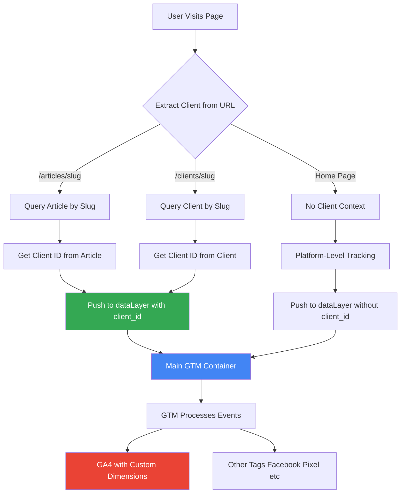

# GTM Multi-Client Implementation Plan

## Architecture Overview

### Flow Diagram



### Key Concepts

1. **Single Main GTM Container**: One GTM container ID (from Settings or env) loads on all pages
2. **Client-Specific Data Layers**: Each event pushed to dataLayer includes `client_id` as unique identifier
3. **Automatic Client Detection**: Client is extracted from URL patterns automatically
4. **Platform-Level Tracking**: Pages without clients still track (no client_id)

## Data Flow

### Step-by-Step Process

1. **Page Load**

   - GTM container script loads (from Settings.gtmContainerId or env)
   - Initial dataLayer initialized

2. **Client Detection**

   - URL pattern analyzed:
     - `/articles/{slug}` → Query Article → Get `clientId`
     - `/clients/{slug}` → Query Client → Get `clientId`
     - Home page → No client (platform tracking)

3. **DataLayer Push**

   - Client context pushed to dataLayer:
     ```javascript
     window.dataLayer.push({
       event: 'client_context',
       client_id: '507f1f77bcf86cd799439011', // Client.id (unique identifier)
       client_slug: 'techcorp-solutions',
       client_name: 'حلول التقنية المتقدمة',
     });
     ```

4. **Page View Tracking**

   - Page view event pushed with client context:
     ```javascript
     window.dataLayer.push({
       event: 'page_view',
       page_title: 'Article Title',
       page_location: window.location.href,
       client_id: '507f1f77bcf86cd799439011', // Always included if client exists
       article_id: '...', // If on article page
     });
     ```

5. **GTM Processing**

   - GTM reads dataLayer
   - Filters/triggers based on `client_id`
   - Sends to GA4 with custom dimensions
   - Can send to client-specific tags if needed

## Implementation Structure

### Files to Create

#### 1. GTM Container Component

**Location**: `beta/components/gtm/GTMContainer.tsx`, `admin/components/gtm/GTMContainer.tsx`, `home/components/gtm/GTMContainer.tsx`

- Server component that injects GTM script
- Gets GTM container ID from Settings (with env fallback)
- Only loads if `gtmEnabled` is true in Settings
- Initializes dataLayer

#### 2. Client Context Helper

**Location**: `beta/helpers/gtm/clientContext.ts`, `admin/helpers/gtm/clientContext.ts`, `home/helpers/gtm/clientContext.ts`

- `extractClientFromURL(pathname: string)`: Extracts client from URL
- `getClientContext(clientId: string)`: Gets client data for dataLayer
- Returns: `{ client_id, client_slug, client_name }` or `null`

#### 3. DataLayer Manager

**Location**: `beta/helpers/gtm/dataLayer.ts`, `admin/helpers/gtm/dataLayer.ts`, `home/helpers/gtm/dataLayer.ts`

- `pushClientContext(clientData)`: Pushes client info to dataLayer
- `pushPageView(data)`: Pushes page view event
- `pushCustomEvent(eventName, data)`: Pushes custom events
- Type-safe TypeScript interfaces

#### 4. GTM Hook

**Location**: `beta/helpers/hooks/useGTM.ts`, `admin/helpers/hooks/useGTM.ts`, `home/helpers/hooks/useGTM.ts`

- React hook for client components
- Auto-detects client from route
- Pushes client context on mount/route change
- Handles Next.js navigation

#### 5. Settings Helper

**Location**: `beta/helpers/gtm/getGTMSettings.ts`, `admin/helpers/gtm/getGTMSettings.ts`, `home/helpers/gtm/getGTMSettings.ts`

- Server function to get GTM settings from database
- Returns: `{ containerId, enabled }`
- Falls back to env variable if Settings not found

### Files to Modify

#### 1. Root Layouts

- `beta/app/layout.tsx`: Add GTMContainer component
- `admin/app/layout.tsx`: Add GTMContainer component
- `home/app/layout.tsx`: Add GTMContainer component

#### 2. Article Pages

- `beta/app/articles/[slug]/page.tsx`: Push client context after fetching article
- Extract client from article.clientId

#### 3. Client Pages

- `beta/app/clients/[slug]/page.tsx`: Push client context after fetching client
- Extract client from client.id

#### 4. Environment Files

- `.env.local` (all apps): Add `NEXT_PUBLIC_GTM_CONTAINER_ID` as fallback

## Technical Details

### DataLayer Structure

```typescript
// Initial dataLayer (created by GTM script)
window.dataLayer = [
  {
    'gtm.start': new Date().getTime(),
    event: 'gtm.js',
  },
];

// Client context push (when client detected)
window.dataLayer.push({
  event: 'client_context',
  client_id: '507f1f77bcf86cd799439011', // Client.id - UNIQUE IDENTIFIER
  client_slug: 'techcorp-solutions',
  client_name: 'حلول التقنية المتقدمة',
});

// Page view with client context
window.dataLayer.push({
  event: 'page_view',
  page_title: 'Article Title',
  page_location: window.location.href,
  client_id: '507f1f77bcf86cd799439011', // Always included if client exists
  article_id: '507f1f77bcf86cd799439012', // If on article page
});
```

### GTM Configuration in Google Tag Manager

1. **Create Custom Dimension Variables**:

   - `client_id` (Custom Dimension 1)
   - `client_slug` (Custom Dimension 2)
   - `client_name` (Custom Dimension 3)

2. **Create Trigger**:

   - Event: `client_context` or `page_view`
   - Condition: `client_id` is not empty

3. **Configure GA4 Tag**:

   - Send `client_id`, `client_slug`, `client_name` as custom dimensions
   - Fire on page views and custom events

### Settings Priority

1. **Database Settings** (primary): `Settings.gtmContainerId` and `Settings.gtmEnabled`
2. **Environment Variable** (fallback): `NEXT_PUBLIC_GTM_CONTAINER_ID`
3. **Disabled by default**: If neither exists, GTM doesn't load

## Benefits

- **Single Container Management**: One GTM container for all clients
- **Client Segmentation**: Each client's data identified by unique `client_id`
- **Flexible Filtering**: GTM can filter/route events based on `client_id`
- **Scalable**: Easy to add more clients without code changes
- **Centralized Control**: Enable/disable GTM from admin settings
- **Best Practice**: Follows Google's recommended GTM implementation pattern

## Testing Strategy

1. **Verify GTM Script Loads**: Check Network tab for GTM script
2. **Check dataLayer**: Use browser console `window.dataLayer`
3. **GTM Preview Mode**: Verify events appear in GTM preview
4. **GA4 Real-Time**: Confirm events reach GA4 with custom dimensions
5. **Client Switching**: Test navigation between different client pages
6. **No Client Pages**: Verify platform-level tracking works
